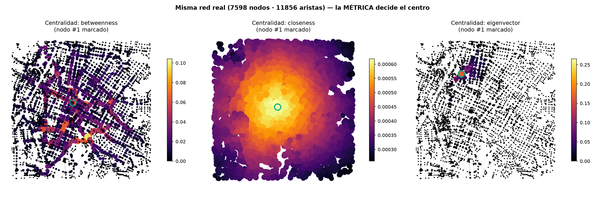
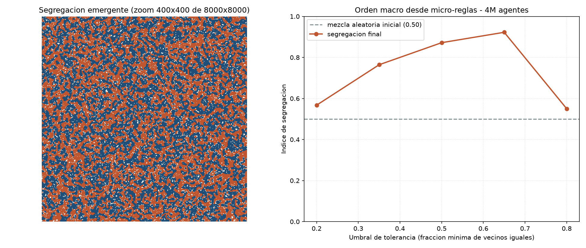

# La ciudad bien asignada
## Cartografía crítica de una Medellín posible
**Steven Vallejo Ortiz · Filosofía de la Ciudad · 2026-1 · Prof. Carolina Álvarez-Valencia · Universidad de Antioquia · 10 de julio de 2026**

> *Ensayo de cartografía crítica (2.000–2.500 palabras). Se acompaña de una tesis de respaldo con
> el aparato completo —trece demostraciones computacionales reproducibles y un experimento propio
> (Vallejo, 2026)—; el argumento de este ensayo es autónomo respecto de ella.*

---

Son las seis de la tarde en el pasaje Junín. El ventero de mangos ha movido su carreta dos metros —los mismos de siempre— para quedar bajo el alero cuando empieza la llovizna; la cámara del poste lo registra como obstrucción del flujo peatonal. En diciembre este corredor será un río de gente que camina lento bajo los alumbrados, y ningún tablero sabrá decir qué se celebra. Desde esta esquina quiero teorizar una ciudad posible. No una utopía: una Medellín que ya existe en fragmentos y solo falta componer.

**La tesis.** La ciudad se autoproduce: genera los componentes —tejido, instituciones, ciudadanos— que a su vez la generan (autopoiesis; lente de lectura, no teorema). El peligro no es que una máquina la gobierne desde afuera, sino que esa autoproducción **se cierre**: que reproduzca siempre las mismas distinciones —la retícula del planificador, la métrica del mercado— y subsuma el resto. El funcionalismo y la ciudad inteligente son esa misma clausura con signo distinto: el primero computó lo emergente; la segunda computa lo relevante — dos maneras de cerrar la ciudad sobre una sola de sus distinciones. La ciudad posible es la ciudad *bien asignada*: no un orden que un soberano imponga, sino la constitución con que la ciudad mantiene su autoproducción **abierta** —distribuye sus propios registros y los deja disputables desde dentro—. **Computa** lo computable: algoritmos exactos, públicos y auditables para lo que tiene solución formal —redes, acueductos, rutas—. **Cultiva** lo emergente: fija condiciones sin decretar resultados, porque el tejido se produce solo. Y **delibera** lo relevante: toda función objetivo pública —qué se mide, qué se optimiza, qué cuenta como problema— es un acto expuesto, plural y revisable.

Esta idea tiene parientes: la métis de Scott contra la legibilidad estatal, la policentría de Ostrom, la planificación deliberativa de Healey, la «subsidiariedad epistémica» de Jasanoff. Se distingue en el fundamento: no asigna por prudencia ni por jurisdicción, sino por un corte mostrable desde el oficio — el límite de lo computable (qué tareas tienen algoritmo exacto y verdad de referencia) lo he medido sobre datos reales; las otras dos fronteras —lo que solo existe desplegándose, lo que ningún optimizador se fija a sí mismo— las sostengo como distinción argumentada, no medida. Y «posible» es lo que Lefebvre llamó utopía experimental: explorar lo posible implicado en lo real. Esta ciudad no exige tecnología inexistente ni un habitante nuevo: recombina instituciones que Medellín ya tiene.

## 1. Ontología: de qué está hecha esta ciudad

¿De qué está hecha una Medellín posible? De tres materias trenzadas, y ninguna es el silicio.

Primero, de **tejido relacional vivo**. El sistema de ciudades se auto-organiza: su jerarquía de tamaños sigue la ley de Zipf sin que autoridad alguna la decrete (verificado sobre 33.933 ciudades: q ≈ 1) — cara empírica consistente con una lectura autopoiética, nunca su prueba. Eso no dice que Medellín se autoproduzca por decreto; es restricción de realismo, no programa: la ciudad posible no se funda en un desierto — es Medellín transformada, con su tamaño y su historia. Su tejido es lo que Gustavo Bueno llamó *symploké*: capas parcialmente conectadas, donde algunas cosas se tocan y otras —por fortuna— no. El hilo más vivo de ese tejido es el que los tableros registran como ruido: la economía informal. El ventero de Junín no es una fricción del flujo; es un productor de ciudad en el sentido de Lefebvre —la ciudad como *obra* y no como producto—, un componente que la ciudad produce y que la produce: sobre la red real, un juego de localización reproduce ese apiñamiento (los venteros se agrupan ~2,6× más que un óptimo de cobertura; tesis, D11) — el foco de Junín es equilibrio emergente, no desorden. Y siete de cada diez medellinenses asocian el centro con esa informalidad (Medellín Cómo Vamos & Invamer, 2024; la encuesta la registra como problema — leerla como tejido es la disputa de este ensayo), informalidad que ninguna función objetivo municipal representa. Una ciudad posible la asume como componente estructural: computa *para* ella, no *contra* ella.

Segundo, de **realidad institucional**. Una métrica urbana es lo que Searle llama *función de estatus*: «X cuenta como Y en el contexto C» — este nodo *cuenta como* central, esta ocupación *cuenta como* invasión. Y una función de estatus no es etiqueta inerte: carga **poderes deónticos** —derechos y deberes que la colectividad hace cumplir—; declarar «oficial» una métrica le da fuerza sobre inversión, vigilancia y renovación. Esos hechos no están en el asfalto: existen porque una institución los declara, y por eso pueden **declararse de otro modo**. Medellín sabe crear hechos institucionales de escala urbana: EPM, pública desde 1955, financia cerca de uno de cada cinco pesos del presupuesto municipal (EPM, 2026), y el presupuesto participativo (Acuerdo 028 de 2017) ya pone el 5 % de la inversión de libre destinación en la deliberación barrial. La ciudad posible está hecha, también, de reglas constitutivas revisables.

Tercero, de **singularidad situada**. Simmel vio en el dinero la nivelación de toda cualidad en cantidad; el algoritmo la industrializa: una misma métrica de eficiencia produce en cualquier ciudad el mismo «centro», el mismo no-lugar que Augé describió. Contra lo genérico, esta ciudad practica lo que Yuk Hui llama cosmotecnia: técnica pensada desde el mundo local que la carga — Medellín tomó un cable industrial de montaña y lo hizo Metrocable, transporte de ladera que ninguna optimización universal habría propuesto (Brand y Dávila, 2011). La singularidad no se conserva en un museo; se produce técnicamente.

## 2. Poder: quién mira, quién mide, quién decide

¿Esta ciudad impone vigilancia física y digital, o habilita espacios libres y autogestionados? La disyuntiva, tomada literalmente, engaña: toda ciudad que gobierna, mide. Y toda métrica es la distinción de un observador —el poder es la asimetría entre los observadores cuyas distinciones el sistema hace *suyas* y las que deja como ruido—: la decisión real no es *si* se mide sino **quién fija la métrica, quién puede refutarla y qué queda fuera de su alcance**. Esta ciudad cambia el estatuto del mirar.

El fundamento está medido. Sobre la red peatonal real del centro de Medellín —7.598 nodos, 11.856 aristas de OpenStreetMap— computé tres medidas exactas de centralidad: intermediación (el paso obligado), cercanía (a menos pasos de todo) y vector propio (conectado con los mejor conectados). Las tres son impecables; sus resultados son casi disjuntos: el cinco por ciento más «central» comparte a lo sumo una esquina de cada diez, a veces ninguna (Jaccard 0,10 / 0,04 / 0,00), y el nodo más central es *un lugar distinto* bajo cada una (fig. 1). Es la verificación local de un resultado conocido (Crucitti, Latora y Porta, 2006), y su lección política es exacta: **el centro no se descubre; se decide** — se decide la métrica, no la materia: el trazado real constriñe (su corredor prominente no es artefacto; tesis, D9), pero nada *en el grafo* dice qué métrica debe importar. Y al medir el cuerpo, el esfuerzo de la pendiente aparta el «centro para quien sube» del «centro del flujo» y le encoge el alcance en la ladera (tesis, D6, D8, D12): la fatiga —el cuerpo de Merleau-Ponty— reescribe la centralidad que la métrica declaraba neutral. Esto sobrevive a cualquier escepticismo sobre la IA: ningún optimizador fija su propia función objetivo — decidir qué se optimiza es exterior a la optimización, y donde esa métrica es pública y disputada, es político.

*Figura 1 — La misma red real del centro de Medellín bajo tres centralidades exactas: los «centros» apenas se solapan. El centro no se descubre: se decide. Esta ciudad hace pública y disputable esa decisión (demostración D5; Tesis, Apéndice).*

De ahí las instituciones del poder en esta ciudad. **Pluralismo métrico obligatorio**: ninguna cartografía pública de asuntos en disputa —seguridad, renovación, inversión— puede publicarse bajo una sola métrica; toda foto oficial lleva su disenso interno a la vista. **Derecho a la contra-métrica**: los datos y el cómputo municipales son bien común auditable, y cualquier junta o veeduría puede computar y publicar su propia lectura — otro observador que reingresa su distinción al sistema, no una liberación que venga de afuera; la soberanía de cómputo se vuelve infraestructura pública. **Deliberación de métricas**: el presupuesto participativo, que ya decide el 5 % de la inversión, se extiende de los recursos a las funciones objetivo — la comunidad no solo decide qué se construye, sino qué se mide y qué no se vigila. Y la **asimetría se invierte**: el algoritmo público es auditable; el ciudadano, opaco por defecto. Habrá cámaras —negarlo sería distopía al revés—, pero su estatuto cambia, y habrá **espacios libres y autogestionados** por diseño —zonas y horas fuera de registro, acotadas y reversibles, decididas en común—, donde la comunidad resiste sin tutela algorítmica: lo que la modulación no ve, no puede gobernar. Es el diagnóstico de Deleuze sobre las sociedades de control tomado por su final: «buscar nuevas armas».

Sé que la deliberación es capturable —el presupuesto participativo ha sido colonizado por clientelismos y actores armados—. Por eso el diseño no presume virtud: pluralidad obligatoria (la captura debe capturar *varias* métricas a la vez), contra-métrica (refutable con los mismos datos), sorteo y rotación, disenso publicado en vez de consenso fabricado. No una ciudad sin conflicto: una donde el conflicto tiene escenarios en vez de algoritmos que prometen suprimirlo.

## 3. Técnica: superar el funcionalismo sin repetirlo

¿La técnica sirve al capital o a la emancipación? Heidegger advirtió que quedamos «encadenados a la técnica» incluso al negarla, y del peor modo cuando la creemos neutral (1954/1994): no se decide en la máquina sino en la propiedad y los fines —la misma red de sensores sirve al capital si sus métricas las fija el mercado, a la emancipación si las fija la deliberación—. Ni tecnofilia ni tecnofobia: asignación. Por eso el poder precede a la técnica: la infraestructura de cómputo es pública y local —descapitalizar el dato es la condición—.

Medellín conoce de primera mano el fracaso del urbanismo funcionalista: el Plan Piloto de Wiener y Sert (1948–1952), con su fe en la ciudad-máquina de funciones separadas, fue desbordado por la ciudad real, que creció por las laderas sin pedir permiso a la Carta de Atenas. El funcionalismo fracasó por un **monopolio del juicio**: uno reflexiona —el planificador fija la regla— y millones son subsumidos. Su error no fue planificar, sino cerrar la ciudad sobre la distinción del plano: trató como *instrucción* lo que solo puede ser *perturbación*, y decretó la vida que debía brotar de la forma. Que el todo sea autónomo de sus partes no es metáfora: el ruteo de miles de viajeros produce un flujo agregado que nadie eligió, y cerrar una calle puede mejorarlo (paradoja de Braess sobre la red real; tesis, D10) — la ciudad computada devuelve resultados que su computador no controla. La automatización total lo repetiría con máquinas mejores. Y no vale que el algoritmo «aprenda de la calle»: aprender la distribución de lo actual es congelar el pasado como futuro; la subsunción estadística *forcluye lo posible* donde un proyecto de ciudad necesita abrirlo. Lo ilustré desde el oficio —experimento propio, ilustrativo no estadístico—: modelos de lenguaje evaluados contra verdad de referencia imitan la forma de los resultados sin ganar la capacidad de ejecutarlos (Vallejo, 2026, §2); y decidir qué debería contar ni siquiera es tarea de ese orden.

Cultivar lo emergente tampoco es dejar hacer. El autómata de Schelling lo muestra desde dentro (fig. 2): basta inyectar en un modelo una preferencia local leve para que la segregación global emerja sin que nadie la diseñe — prueba de principio, no retrato de la vivienda real. Lo emergente no es benigno por ser espontáneo — el laissez-faire también es un plan, solo que sin dolientes. Cultivar significa fijar condiciones de contorno (suelo, usos, transporte), monitorear con el cómputo los atractores conocidos —la segregación se mide—, y deliberar qué emergencias son intolerables. Es lo contrario de Hayek: para él la métrica del orden espontáneo —el precio— está fuera de toda deliberación; aquí es *el* objeto deliberado. Y no es hipótesis: el urbanismo social de los dos mil —Metrocable, parques-biblioteca— fue cultivo estatal de emergencia: cambió condiciones en las laderas sin decretar conductas, y la evidencia registró caídas diferenciales de violencia donde llegó el cable (Cerdá et al., 2012). Jacobs tenía el principio: no se diseña la vida de la acera — se habilitan sus condiciones generadoras.

*Figura 2 — Segregación emergiendo de preferencias locales leves (Schelling). La ciudad posible no decreta la mezcla ni la deja al azar: cultiva condiciones, monitorea umbrales, delibera la intervención (demostración D4; Tesis, Apéndice).*

¿Y el agenciamiento humano? Ni soberano ni ausente: **inmanente**. Quien habita no programa la ciudad desde afuera —ese es el sueño funcionalista—; la perturba desde dentro: la perturbación *gatilla* el cambio, no lo especifica; lo determina la estructura (acoplamiento estructural). Su tipo es ese; su medida la gradúa la asignación. Donde hay algoritmo exacto, la agencia se delega al cómputo —rutas, redes, hidráulica, con automatización barata: todo el aparato de este ensayo corrió en un nodo de 32 núcleos, la suficiencia no necesita hiperescaladores—. La IA *sugiere* sin autoridad para decidir: decidir exige un para-qué situado que no está en los datos. Y donde las métricas divergen, se intensifica como deliberación: el juicio de relevancia no se *reserva* a un sujeto soberano — es cómo la ciudad, a través de quienes la habitan, reingresa y disputa sus distinciones, y no hay decisión métricamente neutral que un optimizador tome por ella (cuatro medidas exactas rankean prioridades casi disjuntas, ninguna «la» correcta; tesis, D13). El Banco Epistémico Urbano de la tesis de respaldo —un banco público de modelos, datos y contra-métricas donde la ciudadanía audita y disputa los algoritmos oficiales— es el órgano epistémico de la ciudad, no su cerebro (Vallejo, 2026, §4).

## 4. Cierre: el lunes por la mañana

¿Quién asigna la asignación? No hay un primer asignador soberano del que penda todo: la asignación es un componente que la ciudad produce y reingresa, y la constitución no la funda desde afuera — solo la vuelve explícita y re-perturbable, con marcadores que la disciplinan: donde hay algoritmo exacto y verdad de referencia, se computa; donde métricas legítimas divergen (fig. 1), se delibera; donde el resultado solo existe desplegándose (fig. 2), se cultiva. Y es por aspecto, no por asunto: un semáforo tiene a la vez núcleo computable, métrica disputable y efectos emergentes. La partición no es natural; lo que ofrezco es la constitución para disputarla.

¿Y es posible, o utopía con bibliografía? Hágase la prueba del lunes: el operador existe —EPM, 100 % pública, aporta cerca del 20 % del presupuesto; las universidades—; el vehículo legal existe —el presupuesto participativo, que ya delibera el 5 % de la inversión, y las veedurías de la Ley 850 de 2003—; el piloto de cien días es concreto —deliberar una sola función objetivo ya operante: la métrica que hoy prioriza el centro—; los adversarios tienen nombre (vendedores de vigilancia llave en mano, administraciones que prefieren indicadores opacos); y la captura está tratada, no silenciada. Nada de esto refunda la política ni inventa tecnología: recombina piezas que esta ciudad ya construyó, y una decisión que ningún modelo tomará por nosotros.

A las seis de la tarde, en Junín, el ventero mueve su carreta dos metros. En la ciudad bien asignada, la cámara que lo mira tendrá una métrica pública, su junta podrá computar la contraria, y diciembre seguirá siendo ilegible para todos los tableros — porque producir lo posible no es un privilegio que esta ciudad *reserve* a sus habitantes, sino aquello que su autoproducción realiza *a través* de ellos, y que ninguna máquina, que procesa sin habitar, comparte.

---

## Bibliografía

- Augé, M. (2000). *Los no lugares: espacios del anonimato*. Gedisa. (Obra original de 1992).
- Brand, P., & Dávila, J. D. (2011). Mobility innovation at the urban margins: Medellín's Metrocables. *City, 15*(6), 647–661.
- Bueno, G. (1972). *Ensayos materialistas*. Taurus.
- Cerdá, M., Morenoff, J. D., Hansen, B. B., Tessari Hicks, K. J., Duque, L. F., Restrepo, A., & Diez-Roux, A. V. (2012). Reducing violence by transforming neighborhoods: A natural experiment in Medellín, Colombia. *American Journal of Epidemiology, 175*(10), 1045–1053.
- Concejo de Medellín. (2017). *Acuerdo 028 de 2017: Sistema Municipal de Planeación — planeación del desarrollo local y presupuesto participativo* [modifica el Acuerdo 43 de 2007].
- Crucitti, P., Latora, V., & Porta, S. (2006). Centrality measures in spatial networks of urban streets. *Physical Review E, 73*(3), 036125.
- Deleuze, G. (1990). Post-scriptum sobre las sociedades de control. *L'Autre Journal, 1*.
- EPM. (2026). *Relación con el Distrito de Medellín: transferencias*. https://www.epm.com.co/institucional/sobre-epm/quienes-somos/relacion-distrito-de-medellin/
- Healey, P. (1997). *Collaborative planning: Shaping places in fragmented societies*. Macmillan.
- Heidegger, M. (1994). La pregunta por la técnica. En *Conferencias y artículos* (E. Barjau, Trad.). Ediciones del Serbal. (Obra original de 1954).
- Hui, Y. (2016). *The question concerning technology in China: An essay in cosmotechnics*. Urbanomic.
- Jacobs, J. (2011). *Muerte y vida de las grandes ciudades* (Á. Abad, Trad.). Capitán Swing. (Obra original de 1961).
- Jasanoff, S. (2013). Epistemic subsidiarity — Coexistence, cosmopolitanism, constitutionalism. *European Journal of Risk Regulation, 4*(2), 133–141.
- Lefebvre, H. (2017). *El derecho a la ciudad* (I. Martínez, Trad.). Capitán Swing. (Obra original de 1968).
- Medellín Cómo Vamos & Invamer. (2024). *Encuesta de Percepción Ciudadana de Medellín 2024*.
- Merleau-Ponty, M. (1993). *Fenomenología de la percepción* (J. Cabanes, Trad.). Planeta-Agostini. (Obra original de 1945).
- Ostrom, E. (1990). *Governing the commons: The evolution of institutions for collective action*. Cambridge University Press.
- Scott, J. C. (1998). *Seeing like a state*. Yale University Press.
- Searle, J. (1997). *La construcción de la realidad social* (A. Domènech, Trad.). Paidós. (Obra original de 1995).
- Simmel, G. (1986). Las grandes urbes y la vida del espíritu. En *El individuo y la libertad* (S. Masó, Trad.). Península. (Obra original de 1903).
- Vallejo, S. (2026). *La herramienta sobredimensionada y la aplicación faltante* [tesis de respaldo del presente ensayo: trece demostraciones computacionales reproducibles, experimento T1–T6 y propuesta del Banco Epistémico Urbano]. Repositorio del curso, `tesis/00_tesis.md`.
