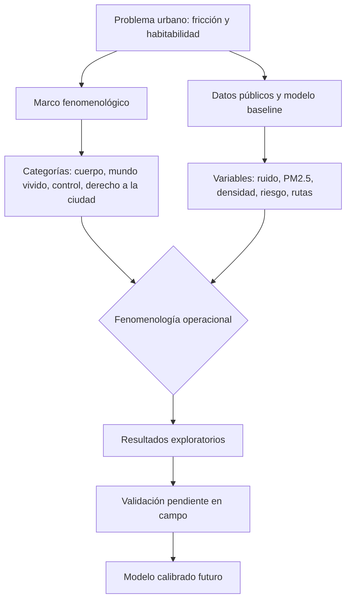

# Capítulo 1. Planteamiento del problema, objetivos y marco teórico

## 1.1. Contexto y problema de investigación

El centro de Medellín concentra funciones urbanas que no siempre conviven de manera armónica: transporte masivo, comercio formal e informal, servicios, equipamientos culturales, vigilancia, presencia institucional, habitantes de calle, turismo, tránsito obligado y permanencias cotidianas. El corredor San Antonio–Junín–Parque Berrío–Plaza Botero es especialmente útil para estudiar esa superposición porque articula estación de Metro, centralidad peatonal, comercio, patrimonio, conflicto de usos y alta exposición sensorial.

El problema de investigación no consiste en afirmar de antemano que el corredor sea “inhabitable”, ni en probar que la infraestructura de movilidad sea negativa. La dificultad es más precisa: muchas evaluaciones urbanas describen el centro mediante indicadores de flujo, accesibilidad, seguridad, uso del suelo o percepción ciudadana, pero pocas integran esas dimensiones con una pregunta fenomenológica por la experiencia corporal del tránsito, la orientación, la pausa, la exposición al ruido, la percepción de riesgo y la restricción práctica de alternativas. A su vez, los estudios puramente descriptivos pueden caer en el extremo contrario: narran la experiencia urbana sin volverla contrastable, reproducible o discutible con datos.

Esta tesis se ubica en esa tensión. Propone un marco de fenomenología urbana asistida por modelación computacional para estudiar cómo distintas capas del corredor producen fricción urbana. La formalización se usa para ordenar hipótesis, construir escenarios y detectar puntos críticos; no para sustituir la observación situada. Por eso el estado actual del proyecto debe nombrarse sin rodeos: es un **baseline proxy** sustentado en fuentes públicas, scripts reproducibles y simulaciones, pero todavía no una validación de campo completa.

## 1.2. Pregunta general y preguntas específicas

La pregunta general de investigación es:

**¿Cómo puede analizarse la habitabilidad fenomenológica del corredor Junín-San Antonio mediante un modelo computacional crítico que integre fricción ambiental, presión peatonal, percepción de riesgo, accesibilidad y restricciones de trayectoria, sin reducir la experiencia urbana a una métrica puramente funcional, y bajo qué condiciones esa habitabilidad colapsa localmente en franjas horarias específicas?**

De esta pregunta se derivan cinco preguntas específicas:

1. **Pregunta teórica:** ¿qué conceptos permiten articular fenomenología, materialidad urbana y modelación computacional sin convertir la simulación en una explicación total de la ciudad?
2. **Pregunta metodológica:** ¿qué variables observables o aproximables pueden representar, de manera limitada pero trazable, dimensiones como fricción ambiental, riesgo percibido, densidad, visibilidad, pausa y libertad de ruta?
3. **Pregunta analítica:** ¿qué patrones emergen en las simulaciones cuando se modifican densidad, escenarios horarios, perfiles de agentes y costos ambientales?
4. **Pregunta de validación:** ¿qué datos de campo son indispensables para pasar de un modelo `baseline_proxy` a una versión calibrada con observación situada?
5. **Pregunta sobre el colapso:** ¿bajo qué combinación de criminalidad registrada, seguridad percibida, habitabilidad declarada y saturación material se puede sostener, en una franja horaria y un nodo concretos, una situación de **colapso fenomenológico** —entendida como suspensión local de la habitabilidad, no como inhabitabilidad absoluta?

Estas preguntas evitan una promesa excesiva. La tesis no pretende capturar “la esencia” del centro de Medellín; busca construir un aparato crítico que haga discutibles sus condiciones de experiencia.

## 1.3. Objetivos

### Objetivo general

Construir y evaluar un marco de análisis fenomenológico-computacional para el corredor Junín-San Antonio, capaz de integrar fuentes públicas, simulación de agentes, campos ambientales y lectura filosófica de la experiencia urbana, explicitando sus límites empíricos y su agenda de validación.

### Objetivos específicos

1. Formular un marco conceptual que articule *Lebenswelt*, cuerpo vivido, vida metropolitana, poder urbano, derecho a la ciudad y materialidad relacional.
2. Definir una operacionalización mínima de variables urbanas relevantes: densidad, ruido, PM2.5, visibilidad, seguridad percibida, permanencia, accesibilidad y restricciones de ruta.
3. Implementar un pipeline reproducible que integre datos públicos, geometría urbana, modelo de caso, agentes simulados, escenarios horarios y salidas visualizables.
4. Analizar resultados de simulación con énfasis en incertidumbre, sensibilidad, entropía, concentración de trayectorias y desigualdad relativa entre perfiles.
5. Delimitar las inferencias que sí permite el modelo y las que quedan pendientes hasta contar con trabajo de campo.
6. Establecer un plan de validación empírica, ética y reproducible para la fase posterior de la investigación.

## 1.4. Hipótesis de trabajo y proposiciones evaluables

La hipótesis central se formula en términos prudentes:

**La eficiencia funcional de un corredor urbano no garantiza por sí misma su habitabilidad fenomenológica; bajo determinadas combinaciones de densidad, ruido, riesgo percibido y presión comercial, la experiencia de tránsito puede volverse más restringida aunque el sistema siga moviendo personas. En franjas horarias específicas, esa restricción puede intensificarse hasta producir lo que esta tesis llamará *colapso fenomenológico*: una suspensión local de la habitabilidad detectable por la convergencia de criminalidad registrada, seguridad percibida deprimida, habitabilidad declarada negativa y saturación material observable.**

Esta hipótesis se descompone en proposiciones evaluables:

- Si los costos de riesgo, ruido y congestión aumentan, las trayectorias simuladas tenderán a concentrarse en menos alternativas.
- Si los agentes tienen perfiles diferenciados —transeúnte rápido, comprador, turista, vendedor o persona con movilidad reducida—, la restricción de ruta no será homogénea.
- Si los campos ambientales se tratan como fricciones y no como fondo neutral, la interpretación de la movilidad cambia: deja de ser solo tiempo de desplazamiento y pasa a incluir exposición corporal.
- Si la criminalidad registrada por mes en comuna 10, la seguridad percibida en encuesta situada, la habitabilidad declarada en entrevistas y la saturación material en videos POV convergen en una misma franja-nodo, esa franja-nodo puede reportarse como colapso fenomenológico; si solo una o dos condiciones se cumplen, la lectura debe permanecer como fricción acumulada.
- Si no se incorporan datos de campo, el modelo debe permanecer como exploratorio y no como diagnóstico concluyente.

## 1.5. Estado del arte mínimo y ubicación del aporte

La investigación dialoga con tres tradiciones. Primero, la fenomenología de Husserl (1936/1991) y Merleau-Ponty (1945/1993), que permite preguntar por el espacio como mundo vivido y no solo como extensión mensurable. Segundo, la teoría urbana crítica, donde Lefebvre (1968/2017), Harvey (2008), Sassen (2014), Foucault (1975/2002), Deleuze (1990) y Simmel (1903/1986) permiten comprender la ciudad como producción social, dispositivo de control, experiencia metropolitana y campo de desigualdad. Tercero, la modelación urbana y los sistemas complejos, donde los modelos basados en agentes, la ciencia de ciudades, la dinámica peatonal y el aprendizaje por refuerzo ofrecen herramientas para formalizar escenarios (Batty, 2013; Bonabeau, 2002; Epstein, 2006; Helbing & Molnár, 1995; Sutton & Barto, 2018).

El aporte no está en inventar una técnica de simulación desde cero ni en resolver definitivamente el problema del centro. Su contribución es metodológica y crítica: propone una traducción controlada entre categorías fenomenológicas y variables computacionales, de modo que la experiencia urbana pueda discutirse con datos, pero sin perder de vista lo que los datos no capturan.

También es importante señalar una carencia del estado actual: falta incorporar de manera más sistemática literatura empírica reciente sobre Medellín, movilidad peatonal, percepción de seguridad, ruido urbano y observación de espacio público en América Latina. Esa ampliación bibliográfica queda como tarea pendiente antes de una versión final de tesis, porque una evaluación universitaria exigente no aceptaría solo autores canónicos y resultados internos del repositorio.

## 1.6. Marco teórico: del mundo vivido a la materialidad urbana

La crítica de Husserl a la “matematización de la naturaleza” no se usa aquí para rechazar la matemática, sino para recordar que toda formalización puede olvidar su origen en el mundo de la vida. La ciudad no es únicamente una red de nodos y aristas; es un campo de orientación corporal, hábitos, expectativas, riesgos, memorias y decisiones situadas. Merleau-Ponty complementa esta lectura al insistir en que el cuerpo no ocupa el espacio como un objeto más: lo habita, lo anticipa y lo padece.

Simmel permite leer la actitud blasé como estrategia metropolitana de filtrado: ante exceso de estímulos, el sujeto selecciona, descarta y acelera. En el centro de Medellín esta idea no debe aplicarse como diagnóstico psicológico individual, sino como hipótesis urbana: ciertos entornos obligan a reducir la atención disponible para poder transitar. Foucault y Deleuze permiten examinar cómo la circulación puede ser orientada por dispositivos, vigilancia, normas, señales, infraestructuras y modulaciones abiertas. Lefebvre y Harvey amplían el problema hacia el derecho a la ciudad: habitar no es solo llegar, sino poder apropiarse, detenerse, orientarse y participar del espacio.

A esta articulación se suma la dimensión de la memoria, desarrollada con detalle en el anexo A. La carga mnémica de los nodos del corredor (operacionalizada en `case_model.json` como un campo `memory` por nodo) no se entiende aquí como un depósito que el lugar contiene, sino como una **disposición distribuida** a que quienes lo transitan reactiven, en cada paso, asociaciones biográficas, culturales y patrimoniales. La teoría reconstructiva de la memoria —desde la metáfora platónica de la tablilla de cera, pasando por la posición lockeana, hasta la evidencia experimental de Bartlett (1932), Loftus (1993), Roediger & McDermott (1995) y la neurociencia de engramas (Tonegawa et al. 2012)— sostiene que el recuerdo no es una copia del pasado sino una construcción presente. Esa construcción es lo que permite leer Plaza Botero o el Museo de Antioquia como *condensadores mnémicos*: lugares donde la disposición a reconstruir está culturalmente amplificada, no porque ellos "tengan" memoria, sino porque organizan la actividad reconstructiva del transeúnte.

Desde Bueno, la noción de *symploké* ayuda a evitar explicaciones de una sola causa. El corredor no es reducible a contaminación, criminalidad, comercio, transporte o percepción. Es una articulación parcial de capas que se conectan y se bloquean. Badiou, por su parte, se usa de manera limitada: el “acontecimiento” no se toma como constatación metafísica del modelo, sino como categoría para pensar rupturas de normalidad cuando un orden de circulación deja de absorber la multiplicidad de cuerpos y prácticas.

## 1.7. La *symploké* urbana como modelo de capas

Para evitar que la noción de atmósfera quede en una impresión vaga, se adopta la *symploké* como hipótesis materialista de lectura. El corredor se organiza en tres planos:

- **Materialidad física ($M_1$):** ruido, PM2.5, iluminación, densidad, geometría, obstáculos, campos de visibilidad y condiciones microambientales.
- **Materialidad fenomenológica ($M_2$):** percepción de seguridad, orientación, pausa, estrés, preferencias de ruta, tolerancia al ruido, familiaridad con el lugar y capacidad corporal diferencial.
- **Materialidad normativa y socioespacial ($M_3$):** vigilancia, comercio formal e informal, regulación, infraestructura de transporte, diseño urbano, desigualdad, dispositivos de control y usos socialmente permitidos o desalentados.

La tesis no afirma que estos planos existan separados en la realidad. La división es analítica: permite ordenar variables y reconocer que la experiencia urbana emerge de sus relaciones.

El colapso fenomenológico, en este esquema, no es un cuarto plano: es un **acoplamiento crítico** de los tres planos en una franja-evento. Sucede cuando la materialidad física se vuelve hostil ($M_1$ saturada), la materialidad fenomenológica se contrae ($M_2$ leída como riesgo y evitación) y la materialidad normativa deja de compensarlo ($M_3$ no orienta, no vigila o vigila demasiado). Por eso la tesis lo trata como una conjunción local y temporal, no como una propiedad del corredor en general; y por eso su detección exige que las cuatro fuentes empíricas —criminalidad, encuesta, entrevista y video— se lean en cruzamiento, no por separado.

## 1.8. Alcance, delimitaciones y riesgos de sobreinterpretación

El caso se delimita al corredor San Antonio–Junín–Parque Berrío–Plaza Botero y a sus nodos operativos definidos en el modelo. No se pretende representar toda Medellín ni toda la comuna 10. Tampoco se pretende que las simulaciones actuales describan trayectorias reales persona por persona. El modelo permite explorar escenarios con datos públicos y supuestos explícitos; la validación fina queda pendiente.

Los principales riesgos de sobreinterpretación son:

1. **Confundir estabilidad numérica con verdad empírica.** Una simulación puede ser estable y aun así estar mal calibrada.
2. **Confundir proxies con observaciones.** La percepción de seguridad, la permanencia o el ruido puntual requieren campo.
3. **Reificar poblaciones vulnerables.** Categorías como “habitantes de calle”, informalidad o inseguridad deben tratarse con cuidado para no convertir condiciones sociales complejas en etiquetas estigmatizantes.
4. **Sobredimensionar la técnica.** La aceleración por GPU y las mallas de alta resolución son medios, no argumentos.
5. **Generalizar el colapso.** Una franja-nodo en colapso no autoriza afirmar que el corredor entero sea inhabitable, ni que esa misma franja-nodo lo sea siempre. El colapso es una observación situada, no una propiedad estructural permanente.

Esta autocrítica no debilita el proyecto; define sus condiciones de evaluación.

## 1.9. Criterios de suficiencia académica del capítulo

Para que este capítulo sostenga una evaluación exigente, debe cumplir cinco criterios:

- presentar un problema investigable y no solo una intuición filosófica;
- formular preguntas y objetivos verificables;
- distinguir marco conceptual, modelo computacional y evidencia empírica;
- declarar límites, riesgos y tareas pendientes;
- evitar tanto la poesía sin método como la simulación sin reflexión crítica.

La versión actual avanza en esos criterios, pero no debe considerarse cerrada hasta completar revisión bibliográfica empírica reciente y validación de campo.
