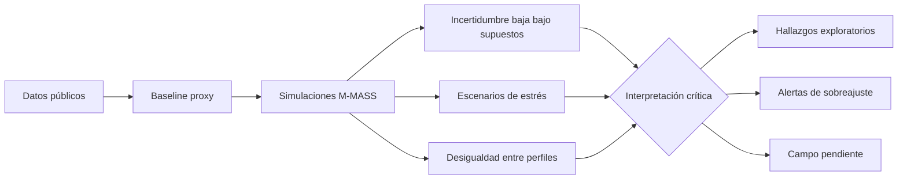

# Capítulo 3. Resultados, discusión y evaluación crítica

## 3.1. Criterio de lectura de resultados

Los resultados del modelo M-MASS se presentan como una lectura exploratoria del corredor Junín-San Antonio. No sustituyen la observación directa ni autorizan conclusiones definitivas sobre todos los usuarios del centro de Medellín. Su aporte principal consiste en organizar datos públicos, supuestos de modelación y escenarios de simulación para discutir patrones de fricción ambiental, concentración de trayectorias y presión de flujo.

La regla interpretativa de este capítulo es la siguiente: **cada resultado debe indicar su fuente, su grado de evidencia y su límite**. Por eso se diferencian tres niveles:

- **Evidencia pública secundaria:** datos descargados de fuentes institucionales o públicas.
- **Resultado computacional:** salidas producidas por scripts del repositorio bajo supuestos definidos.
- **Validación pendiente:** datos que solo pueden obtenerse mediante observación situada.

## 3.2. Evidencia empírica secundaria: centro ambivalente y fricción urbana

El archivo `empirical_summary.json` permite establecer un primer punto no especulativo: la imagen del centro de Medellín es ambivalente. La Encuesta de Percepción Ciudadana 2024, levantada por Invamer para Medellín Cómo Vamos, reporta 53.3% de imagen favorable y 44.5% de imagen desfavorable. Los principales motivos de visita se asocian con comercio (42.9%), servicios de salud (16.9%) y trabajo (16.1%). Las asociaciones dominantes incluyen comercio (65.6%), inseguridad (70.5%), informalidad (70.9%), congestión (82.8%) y habitantes de calle (66.2%) (Medellín Cómo Vamos & Invamer, 2024).

Estas cifras no prueban por sí mismas una tesis fenomenológica, pero sí justifican el caso: el centro aparece como un espacio de alta funcionalidad y alta fricción percibida. En términos teóricos, esto permite discutir la diferencia entre centralidad urbana y habitabilidad. Un lugar puede ser muy usado, muy necesario y al mismo tiempo experimentado como agotador, inseguro o difícil de habitar.

La criminalidad agregada de comuna 10 muestra que en 2023 la conducta dominante fue hurto a persona, con 5,888 casos registrados; le siguen, a distancia considerable, hurto de moto (593), extorsión (94), hurto a residencia (86) y hurto de carro (76). Esta cifra debe manejarse con cuidado: no se traduce automáticamente en percepción individual de miedo ni permite etiquetar todo el corredor como inseguro. Sirve, más bien, para sostener que la seguridad no puede quedar fuera del modelo de experiencia urbana, y para fijar uno de los cuatro ejes (C1) sobre los que se construye la categoría de **colapso fenomenológico** introducida en el capítulo 2.

La serie mensual de comuna 10 también ofrece una estructura útil para la triangulación: entre 2016 y 2019 los casos crecieron de 7,511 a 15,429, con caída en 2020 (9,306) y un nuevo ciclo entre 2022 (11,260) y 2023 (6,737). Dentro de 2023 el pico mensual disponible es mayo (811 casos) y el valle hacia el cierre de la serie pública es noviembre (213 casos). Esta variación —en órdenes de magnitud por mes— es la base sobre la que el campo intentará proyectar una distribución por franja horaria, dado que MEData no publica la hora del hecho. La proyección horaria es un supuesto documentado, no una medición; cualquier afirmación de colapso en un horario específico exige que las otras tres condiciones (C2 encuesta, C3 entrevista, C4 saturación) lo respalden de manera independiente.

Los indicadores barriales de La Candelaria también muestran tensiones estructurales: densidad empresarial alta, concentración de suelo múltiple y bajo espacio público efectivo por habitante. De nuevo, la lectura debe ser prudente: estos datos son de escala barrial y no reemplazan mediciones finas en los nodos del corredor.

## 3.3. Estado de fuentes y trazabilidad del pipeline

El archivo `source_status.json` reporta 19 fuentes intentadas, 15 descargadas y 4 fallidas. Este resultado es metodológicamente importante porque documenta tanto logros como huecos de acceso. Las fuentes fallidas incluyen páginas de MEData por tiempo de espera y el geovisor DANE por respuesta 403.

Un jurado puede preguntar si esos faltantes invalidan el trabajo. La respuesta debe ser matizada: no invalidan el pipeline, pero sí obligan a limitar el alcance. La tesis no debe afirmar que incorporó toda la información pública disponible; debe afirmar que integró un conjunto verificable de fuentes y que documentó los bloqueos pendientes.

## 3.4. Modelo de caso: cobertura y simplificación

El archivo `case_model.json` contiene 9 nodos, 13 aristas, 5 perfiles de agentes y 4 escenarios horarios. Esta estructura es suficiente para explorar el corredor, pero no para representar toda la complejidad de La Candelaria. La discretización permite comparar rutas y condiciones, aunque pierde microvariaciones: cruces informales, obstáculos temporales, vendedores móviles, cambios por día de semana, clima, operativos de seguridad o eventos culturales.

La virtud del modelo es su claridad. Su defecto es la simplificación. Una tesis seria debe conservar ambas afirmaciones juntas.

## 3.5. Resultados ambientales y advertencia de calibración

El reporte `hpc_environmental_report.json` registra una simulación ambiental de resolución 4096x4096. El resultado produce campos relativos de PM2.5 y ruido, útiles para estudiar gradientes e intensidad espacial dentro del modelo. Sin embargo, los valores pico reportados no deben presentarse como mediciones normativas reales. Antes de compararlos con estándares ambientales, se requiere calibración con estaciones, medición puntual y ajuste de unidades.

La utilidad actual de estos campos es relacional: permiten evaluar cómo cambia la navegación de agentes cuando ciertos sectores se vuelven más costosos por exposición ambiental. Su límite es empírico: sin medición de ruido y aire en campo, la magnitud absoluta no está validada.

## 3.6. Incertidumbre numérica: estabilidad no equivale a verdad

El análisis de cuantificación de incertidumbre (`hpc_uncertainty_quantification.json`) arroja incertidumbres relativas bajas en tres franjas:

| Franja | Velocidad media | Incertidumbre relativa | Intervalo 95% |
| --- | ---: | ---: | --- |
| 06:00 | 1.2719 | 0.000232 | [1.27185, 1.27201] |
| 12:00 | 1.2720 | 0.000279 | [1.27187, 1.27207] |
| 18:00 | 1.2720 | 0.000263 | [1.27191, 1.27209] |

Este resultado indica estabilidad numérica bajo las condiciones ensayadas. No demuestra que el comportamiento real tenga baja variabilidad. Una simulación puede ser estable porque el sistema está bien implementado, porque los supuestos reducen demasiado la diversidad o porque faltan perturbaciones empíricas. Por tanto, la incertidumbre baja se interpreta como propiedad del experimento, no como propiedad definitiva del centro.

## 3.7. Estrés urbano: escenario límite y no capacidad real

El experimento `hpc_urban_stress_test.json` explora una curva de 100,000 a 500,000 agentes simultáneos. En ese rango, la entropía del sistema —entendida como medida de dispersión del estado simulado (Shannon, 1948)— aumenta de 4.59 a 5.40. La velocidad media desciende de 1.2763 a 1.2700 hacia el extremo superior del escenario, mientras el índice de presión pasa de 0.3815 a 1.9073.

| Agentes | Velocidad media | Entropía | Índice de presión |
| ---: | ---: | ---: | ---: |
| 100,000 | 1.2763 | 4.5946 | 0.3815 |
| 500,000 | 1.2700 | 5.4094 | 1.9073 |

El punto de 500,000 agentes se reporta como umbral interno del escenario ensayado. No debe presentarse como capacidad real verificada del corredor. Su valor está en mostrar una tendencia: al aumentar la presión, el sistema simulado se vuelve más entrópico y ligeramente menos fluido. La lectura filosófica del “acontecimiento” (Badiou, 1998) puede aplicarse solo como interpretación de escenario límite, no como prueba empírica de colapso urbano.

## 3.8. Ciclo de 24 horas y perfiles temporales

El reporte `hpc_24h_simulation_report.json` registra 640,000 agentes simulados acumulados durante un ciclo de 24 horas. Las horas de madrugada simulan cargas bajas y las franjas diurnas/nocturnas aumentan la presión según el perfil temporal. Este resultado permite introducir una dimensión temporal: el corredor no es el mismo a las 07:00, a las 12:00, a las 18:00 o a las 21:00.

La limitación principal es que el perfil horario todavía depende de supuestos y fuentes agregadas. Debe contrastarse con conteos reales por ventana de 15 minutos. Sin esa validación, la curva temporal es una hipótesis de trabajo.

## 3.9. Desigualdad de libertad de ruta entre perfiles

El archivo `urban_inequality_analysis.json` reporta un Gini de entropía entre 0.0402 y 0.0435 según escenario. También identifica al perfil de turista cultural como el más restringido y al perfil de movilidad reducida como el más libre en los escenarios actuales, con razones de inequidad entre 1.24 y 1.27.

Este resultado debe discutirse con mucha cautela. Que el perfil de movilidad reducida aparezca como “más libre” puede ser contraintuitivo y podría indicar un efecto de especificación del modelo: tal vez sus metas, pesos o rutas disponibles están generando mayor dispersión formal, no necesariamente mayor libertad real. Este es un ejemplo claro de por qué el modelo necesita sensibilidad y campo. Una salida inesperada no debe maquillarse; debe convertirse en pregunta metodológica.

La lectura defendible es: el modelo ya permite comparar desigualdades relativas entre perfiles, pero la interpretación sustantiva de esa desigualdad todavía requiere revisar pesos, rutas, obstáculos y evidencia situada.

## 3.10. Aprendizaje por refuerzo y filtrado decisional

La convergencia de políticas de aprendizaje por refuerzo en los agentes (`UrbanPhenomenologyDQN`) permite proponer la noción de **actitud blasé computacional** como metáfora controlada. No se afirma que la red neuronal experimente indiferencia; se observa que el agente aprende a priorizar ciertas variables y a ignorar otras para minimizar costos dentro del entorno definido.

La analogía con Simmel ayuda a describir cómo, en espacios saturados, la selección de estímulos puede convertirse en estrategia de tránsito. En términos de Deleuze (1990), el agente simulado aparece como “dividual” porque es tratado por el modelo como vector de atributos y decisiones. Esta lectura es útil críticamente, siempre que no se confunda la simplificación computacional con la totalidad de la experiencia humana.

## 3.11. Calibración HPC y signos de sobreajuste

Los reportes `hpc_calibration_report.json` y `hpc_multipoint_calibration.json` muestran calibraciones internas con errores muy bajos y puntajes de ajuste muy altos. En una lectura superficial, esto podría parecer fortaleza. En una lectura rigurosa, exige sospecha: ajustes casi perfectos pueden indicar que el problema está demasiado controlado, que hay pocos puntos de validación o que el modelo está ajustándose a objetivos definidos internamente.

Por tanto, estos reportes deben usarse como evidencia de que el sistema puede optimizar parámetros, no como prueba de que la ciudad real fue calibrada. El paso crítico será contrastar esos parámetros con datos de campo independientes.

## 3.12. Estado de campo: campo realizado, triangulación en curso

La calibración de campo (`field_calibration_delta.json`) salió del estado `pending_no_capture` con la jornada efectivamente ejecutada antes del 6 de mayo de 2026. El estado actual del archivo, sin embargo, no es aún `field_calibrated` sino **`field_ingest_in_progress`**: los conteos, fotos y notas aguardan ingesta a `investigacion/data/interim/YYYY_MM_DD/`; las entrevistas semiestructuradas se encuentran en transcripción a cargo de un colaborador externo bajo acuerdo de confidencialidad; los videos POV y de saturación están en cola para procesamiento en torre HPC con GPU del autor.

Esta distinción importa para la lectura del capítulo: lo que sigue **no son resultados de campo**. Son los andamiajes de las cuatro líneas analíticas que la tesis se propone reportar cuando termine la triangulación, junto con las salvaguardas que cada una requerirá. El compromiso académico es no escribir nada en estas subsecciones que no esté respaldado por la matriz `collapse_matrix.json` cuando exista.

### 3.12.1. C1 — Criminalidad como eje temporal

La línea de criminalidad ya está cargada desde MEData y discutida en 3.2 a escala de comuna 10 y mes. Lo que falta es proyectar esa serie hacia la malla nodo × franja del modelo y declarar el supuesto distribucional que se use (uniforme por franja, ponderado por horario público típico de hurto, o derivado de literatura). Cualquiera de estas opciones se asume como hipótesis, no como medición horaria. La salida final entregará, por cada celda, si supera o no el umbral de su percentil 75.

**Estado:** datos disponibles, proyección horaria pendiente.

### 3.12.2. C2 — Seguridad percibida en encuesta breve

La encuesta breve recogida en campo (escala 1–5 más códigos de incomodidad) alimentará la columna `security_score` de `field_counts_*.csv` por nodo y franja. El reporte debe incluir tamaño muestral por celda, distribución de respuestas y advertencia explícita sobre la imposibilidad de leer una franja-nodo con menos de un mínimo de respuestas (sugerido: 10).

**Estado:** datos en cuaderno y formularios; ingesta a CSV pendiente.

### 3.12.3. C3 — Habitabilidad declarada en entrevistas

Las entrevistas semiestructuradas formulan dos preguntas eje: cuándo el corredor se vuelve **difícil de vivir** y cuándo es **deseable** estar en él. Las transcripciones se codificarán con el esquema `HABITABLE / DESEABLE / EVITABLE / NO_DESEABLE / DIFICIL_DE_VIVIR / AMBIVALENTE` y se ubicarán por nodo y franja cuando la persona entrevistada lo haya nombrado explícitamente. El reporte distinguirá entre ubicaciones nombradas por las personas y atribuciones del investigador, para no forzar la espacialización de testimonios genéricos.

**Estado:** transcripciones en proceso (colaborador externo).

### 3.12.4. C4 — Saturación material en video

Los videos POV y los recorridos por sectores se procesarán en torre HPC con GPU. El producto esperado es `investigacion/data/processed/video_saturation_*.json` con métricas de densidad por frame, conteo automático y un indicador agregado de saturación por celda. Esta línea reemplazará, allí donde el video lo permita, el `crowding` proxy del modelo. La cobertura no será simétrica: habrá celdas con video y celdas sin él; la matriz de colapso lo reportará explícitamente.

**Estado:** videos crudos archivados; pipeline GPU en preparación.

### 3.12.5. Matriz de colapso fenomenológico

La síntesis de C1–C4 se reportará en `collapse_matrix.json`, con 36 celdas (9 nodos × 4 franjas) y, por celda, los siguientes campos: el valor o estado de cada condición, el conteo de condiciones cumplidas, la decisión final (`flujo_ordinario`, `friccion_acumulada`, `colapso_fenomenologico`) y la cobertura de evidencia (cuántas fuentes aportaron datos a esa celda). Las celdas con cobertura insuficiente se reportarán como `inconcluyente`, no como `flujo_ordinario`.

Esta matriz es el resultado cuantitativo central de la fase empírica. Si al construirla se encuentra que ninguna celda alcanza la convergencia mínima de tres condiciones, el capítulo deberá reportarlo así; el rigor exige aceptar esa posibilidad y no forzar la categoría.

**Estado:** no construida.

### 3.12.6. Lectura cualitativa complementaria

Más allá de la matriz, el conjunto de notas fenomenológicas, fotos y recorridos POV se usará para una lectura cualitativa de las celdas en colapso o fricción acumulada. El propósito de esta lectura no es ilustrar la matriz, sino exponer lo que la matriz no captura: trayectorias acortadas, pausas evitadas, miradas desviadas, atmósferas y discursos. Esta capa se reporta sin pretensión de generalización.

**Estado:** insumos en archivo; redacción tras matriz.

## 3.12bis. Resultados preliminares de la jornada del 5 de mayo de 2026

Esta sección reporta lo que el pipeline ya produjo a partir de la jornada del 5 de mayo de 2026. Es un **avance de procesamiento**, no la matriz final. Antes de cualquier afirmación interpretativa conviene declarar la cobertura observada y sus límites.

### Cobertura del corpus procesado

La jornada produjo 17 videos POV/saturación (~11 GB en total), 15 fotografías de campo (~50 MB) y un conjunto de notas y encuestas todavía en ingesta. Al momento de cierre de esta primera pasada, el pipeline `fenomurb/proc:cuda128` había procesado en torre HPC: seis videos completos (incluyendo la versión recodificada de uno de 2.5 GB), las quince fotos con detección multi-clase y EXIF, y cinco transcripciones de audio vía Whisper. Los nueve videos restantes están en cola de compresión local (libopenh264 sobre CPU 20 cores) y subida a la torre.

La cobertura **espacial** es asimétrica. Las quince fotografías llevan EXIF GPS válido y se asignan al nodo más cercano del modelo M-MASS por distancia haversine (`scripts/hpc/assign_nodes.py` →  `data/processed/photo_node_assignments.json`). La distribución resultante es:

| Nodo | Fotos asignadas | Distancia mínima al nodo |
| --- | ---: | --- |
| `junin_paseo` | ~7-8 | < 100 m |
| `carabobo_cultural` | ~4 | ~140 m |
| `parque_berrio` | 2 | ~210 m (frontera con `carabobo_cultural`) |
| `san_antonio_metro` | 1 | ~60 m |
| Resto de nodos | 0 | — |

El sesgo hacia Junín es real y reconocido: la jornada se concentró en ese eje y deja sin cobertura fotográfica directa a `parque_san_antonio`, `palacio_nacional`, `oriental_cruce`, `plaza_botero` y `museo_antioquia`. La matriz final tendrá que reportar esas celdas como `inconcluyente` por C4 hasta que entren más jornadas, o complementarlas con video cuando se confirme su ubicación.

La cobertura **temporal** es de una sola jornada y se concentra en el tramo 8:30–11:46 (peak_am extendido y midday temprano), con un único video al 21:30 (night). Las franjas `peak_pm` y la mayor parte de `night` están ausentes en el material procesado hasta ahora.

### Conteos automáticos por foto

Las quince fotografías procesadas con YOLO11x a 1280 px arrojan rangos de personas detectadas que van de 0 a 30 por cuadro. Los valores más altos —y las saturaciones más altas— aparecen en dos puntos:

- una foto en la zona de `san_antonio_metro` con **26 personas detectadas** y `saturation_index = 0.88`;
- una foto en la zona de `parque_berrio`/`carabobo_cultural` con **30 personas detectadas** y `saturation_index = 0.80`.

Estos valores no constituyen evidencia de colapso por sí solos: son lecturas puntuales de un cuadro fijo en un instante. Lo que sí permiten sostener es que la jornada captó momentos de densidad sustantiva en al menos dos nodos del corredor, lo que justifica priorizar esos nodos en jornadas futuras o en el procesamiento de los videos pendientes.

### Tracking de personas en video

El procesamiento con BoTSORT sobre los seis videos disponibles produjo conteos de personas únicas por video que oscilan entre 0 y **129 personas únicas en `VID_20260505_110910` (40 segundos de duración, 1080p)**. Los videos también permiten extraer permanencia mediana, velocidad aparente en píxeles, audio (dB-FS RMS por segundo) y detecciones de motos, autos, mochilas y celulares. Estas métricas están disponibles celda por celda en `video_saturation_*.json` pero la asignación de cada video a un nodo específico depende del mapeo manual que el operador del campo pueda confirmar (los archivos del celular no embeben GPS en el contenedor MP4).

### Transcripción de audio

El servicio Whisper ASR local produjo transcripciones para los videos con audio audible. Tres de los cinco transcritos quedaron sin contenido lingüístico (audio ambiente sin habla); uno produjo un fragmento corto en español (`VID_20260505_213002`, 21:30, 18.5 s de procesamiento). Las transcripciones constituyen un insumo complementario para C3 (habitabilidad declarada), pero no la sustituyen: la fuente principal sigue siendo el conjunto de entrevistas semiestructuradas en transcripción por colaborador externo.

### Lo que estos resultados todavía no permiten afirmar

Aunque hay datos automáticos sólidos por foto y por video, **no se puede declarar todavía una sola celda en colapso fenomenológico**. Las razones son explícitas:

1. **C3 sin codificación.** Las entrevistas no han llegado codificadas; sin esquema `HABITABLE/EVITABLE/...` aplicado, C3 es `false` para todas las celdas.
2. **C2 sin ingesta.** Los `field_counts_*.csv` con `security_score` por nodo y franja todavía no están en `data/interim/YYYY_MM_DD/`.
3. **Cobertura asimétrica.** Solo nueve videos procesados con asignación de nodo (seis con confianza `medium` o `high`), y solo cuatro nodos del corredor cubiertos por C4: `san_antonio_metro`, `junin_paseo`, `parque_berrio` y, por proximidad, `carabobo_cultural`.

Aplicar la regla 3-de-4 a este estado parcial daría falsos negativos en todas las celdas. Por eso el reporte se limita a describir el corpus procesado y deja la regla suspendida en sus celdas en `inconcluyente` hasta que las cuatro condiciones tengan al menos una pasada de ingesta.

### Primera matriz de colapso construida

A pesar de los faltantes, la matriz `data/processed/collapse_matrix.json` ya se computa con C1 (proyección horaria documentada) y C4 (saturación de video por nodo). El reparto inicial de las 36 celdas es:

| Decisión | Celdas |
| --- | ---: |
| `inconcluyente` | 33 |
| `flujo_ordinario` | 2 |
| `friccion_acumulada` | **1** |

La única celda con fricción acumulada en esta primera pasada es **`parque_berrio | midday`**, que cumple C4 (`saturation_p75` por encima del p75 global) sin convergencia con las otras condiciones. Las dos celdas en `flujo_ordinario` son `san_antonio_metro | peak_am` y `junin_paseo | peak_am`, donde C1, C4 y la cobertura disponible no superan ningún umbral. El estado `friccion_acumulada` es importante por sí mismo: dice que hay una franja-evento donde la materialidad (saturación visible y sonora en video) ya alerta, aunque el resto de fuentes todavía no esté disponible para confirmar o descartar colapso.

El supuesto distribucional de C1 (peak_am 0.20, midday 0.20, peak_pm 0.45, night 0.15, derivado de Cohen & Felson 1979 y Brantingham & Brantingham, ver `data/processed/c1_hourly_projection.json`) hace que el percentil 75 por franja sea más alto en `peak_pm` (62.5 hurtos/hora proyectados) que en las otras tres franjas. La mediana mensual histórica produce tasas por debajo de ese percentil, lo cual implica que en el "mes típico" C1_high es `false` para todas las franjas. Solo los meses pico de la serie (mayo y julio de varios años) lo activarían — pero la celda no se evalúa contra una franja específica de un mes, sino contra el supuesto de tasa típica.

Este reporte parcial cumple su función académica: muestra que el pipeline produce decisiones legibles con cobertura declarada y que la regla 3-de-4 se respeta sin atajos. La matriz se reconstruirá automáticamente cada vez que entren más datos a cualquiera de las cuatro condiciones.

## 3.13. Resultados que sí pueden sostenerse y resultados que no

| Afirmación | Estado | Justificación |
| --- | --- | --- |
| El centro tiene percepción ambivalente | Sostenible | EPC 2024 integrada en `empirical_summary.json` |
| La criminalidad de comuna 10 tiene estructura mensual marcada | Sostenible | serie MEData 2016–2023 |
| El pipeline integra fuentes públicas trazables | Sostenible | `source_status.json` documenta fuentes y fallas |
| El modelo produce escenarios de presión y fricción | Sostenible | salidas M-MASS y scripts del repositorio |
| La simulación muestra estabilidad numérica | Sostenible bajo supuestos | Monte Carlo con baja incertidumbre relativa |
| El corredor real colapsa a 500,000 agentes | No sostenible | es umbral interno de escenario simulado |
| El campo se realizó con cobertura mínima | Sostenible | jornada ejecutada antes del 2026-05-06 |
| La experiencia real está calibrada | Pendiente de matriz | `field_ingest_in_progress`; falta `collapse_matrix.json` |
| Existen franjas-nodo en colapso fenomenológico | Pendiente de matriz | requiere convergencia de C1–C4 verificada |
| Los perfiles simulados equivalen a sujetos reales | No sostenible | son tipos analíticos simplificados |
| La desigualdad de ruta está demostrada empíricamente | Parcial | métrica simulada, falta cruce con campo |

## 3.14. Discusión filosófica de los resultados

Los resultados sugieren que el corredor puede leerse como un sistema de fricciones acumuladas. La experiencia urbana no depende solo de la posibilidad abstracta de pasar por un lugar, sino de las condiciones bajo las cuales se pasa: ruido, presión, riesgo, visibilidad, orientación, comercio, vigilancia y posibilidad de detenerse.

Desde Merleau-Ponty, la movilidad no es una línea trazada en un mapa, sino una práctica corporal. Desde Simmel, el exceso de estímulos puede conducir a estrategias de filtrado. Desde Lefebvre y Harvey, el derecho a la ciudad no se reduce al acceso físico; incluye apropiación, permanencia y agencia. Desde Foucault y Deleuze, el movimiento puede ser orientado por dispositivos que no necesariamente prohíben, pero sí modulan. Y desde la teoría reconstructiva de la memoria (Bartlett 1932; Schacter, Addis & Buckner 2007; Matthen 2010, ver anexo A), los testimonios sobre el corredor no son lecturas de una huella estable: son construcciones presentes guiadas por esquemas culturales. Esto hace que C3 dependa, no de la fidelidad de cada recuerdo aislado, sino de la coherencia entre testimonios, criminalidad registrada, encuesta situada y saturación material —es decir, de la triangulación misma.

La simulación ayuda a ordenar estas tensiones, pero no las resuelve. Su valor está en hacer explícitos los supuestos y generar preguntas mejores para el campo.

## 3.15. Diagrama de lectura crítica

## 3.16. Balance del capítulo

El capítulo muestra avances reales: datos públicos integrados, pipeline trazable, modelo de caso, simulaciones, incertidumbre, estrés, ciclo horario, desigualdad relativa entre perfiles y un campo ya realizado con un protocolo multimodal (criminalidad, encuesta, entrevista, video). También muestra límites importantes: la triangulación de campo aún no se ha sintetizado en `collapse_matrix.json`, falta sensibilidad sistemática, falta validación externa y algunas salidas requieren revisión crítica.

La tesis gana fuerza cuando evita declarar verdades cerradas y, en cambio, muestra con precisión qué patrones emergen del modelo, qué supuestos los producen, qué condiciones empíricas se reportarán franja por franja y qué observaciones faltan por procesar para confirmarlos, corregirlos o refutarlos. La defensa académica del concepto de colapso fenomenológico depende, sin atajo, de que esa matriz exista y se sostenga; mientras tanto, el concepto queda definido y operacionalizado, pero sin reporte aún.
