# La herramienta sobredimensionada y la aplicación faltante
## Tesis de respaldo del ensayo «Cartografía crítica: la ciudad posible»
**Steven Vallejo Ortiz · 2026-1 · Prof. Carolina Álvarez-Valencia · Universidad de Antioquia**

> **Función de este documento.** Esta tesis es el **respaldo técnico y filosófico** del ensayo
> de cartografía crítica ([`ensayo/00_ensayo.md`](../ensayo/00_ensayo.md), 2000–2500 palabras),
> que teoriza la ciudad posible. El ensayo es autosuficiente; este documento desarrolla en
> extenso lo que allí se remite: el argumento categorial completo (§1–§3), las cinco
> demostraciones computacionales reproducibles (Apéndice y `ciencia/`), el experimento T1–T6 y
> la propuesta del Banco Epistémico Urbano (§4). Las secciones conservan numeración estable para
> citarse como «Tesis, §n».

> **Resumen.** Este documento sostiene que la inteligencia artificial computacional *procesa*
> información urbana pero no *produce* conocimiento de la ciudad: el límite no es de potencia
> —un modelo mayor no lo disuelve— sino **categorial**. La ciudad se autoproduce (autopoiesis,
> emergencia, auto-organización) y es a la vez vivida y política; la máquina no comparte ese modo
> de ser. El argumento se despliega en tres ejes —ontológico, técnica y poder— y se apoya en trece
> demostraciones computacionales propias y reproducibles (cinco núcleo y ocho extensiones), siete de
> ellas sobre la red real de Medellín (además del sistema mundial de ciudades). La conclusión no es tecnófoba ni
> tecno-optimista: es una consigna de uso —*aplicar antes que escalar, fragmentar antes que
> optimizar*— y una aplicación que la ciudad necesita, el Banco Epistémico Urbano.
> **Palabras clave:** ciudad · autopoiesis · fenomenología · cosmotécnica · inteligencia artificial · poder.

> **Tesis rectora.** La IA computacional *procesa* información urbana pero no *produce*
> conocimiento de la ciudad. El límite es **categorial**: la ciudad se auto-organiza, se vive y se
> disputa, y la máquina —que calcula sin habitar— no comparte ese modo de ser. De ahí que la IA
> sea, a la vez, **herramienta sobredimensionada** y **aplicación faltante**.

> **Hilo conductor.** La ciudad se *autoproduce*; el *análisis computacional* intenta conocerla. De
> ese encuentro nacen los tres ejes: **ontológico** (el modo de ser de la ciudad frente al de la
> máquina), **técnica** (qué puede y qué no puede delegarse al cómputo) y **poder** (quién computa
> la ciudad, bajo qué métrica y con qué efectos).

> **Nota metodológica.** El ensayo apoya su argumento en **cinco demostraciones computacionales
> propias** —reproducibles, con código y figuras en `ciencia/`—: ley rango-tamaño de Zipf sobre
> 33.933 ciudades reales (GeoNames), ley de escala de Bettencourt–West sobre datos reales de
> OpenStreetMap, dimensión fractal de una huella urbana, autómata de segregación de Schelling a
> 64 millones de celdas, y centralidad de la red vial **real** de Medellín bajo tres métricas. A estas cinco demostraciones
> núcleo, el Apéndice suma **ocho extensiones** de robustez, escala y dinámica sobre la red real —la
> métrica del cuerpo, el umbral de intervención, la escala ciudad, los modelos nulos, el juego de
> congestión (Braess), la localización de Hotelling, la difusión con pendiente y la decisión
> minimax-regret (D6–D13)—: **trece en total**. Se
> presentan como **cara empírica *consistente con*** una lectura autopoiética de la ciudad, **no**
> como prueba de la autopoiesis en sentido estricto de Maturana–Varela. Las cifras y su encuadre
> honesto están en `ciencia/RESULTADOS.md`; las figuras, en el Apéndice.

---

## 0. Introducción — la ciudad autopoiética frente a su análisis computacional

Las ciudades inteligentes prometen optimización: con inteligencia artificial urbana, afirman sus proponentes, podríamos modelar la movilidad, predecir flujos, anticipar congestiones y hasta suprimir el conflicto mediante algoritmos de equidad. Es una promesa seductora porque ofrece control sobre lo que ha sido históricamente incontrolable: el caos urbano, la segregación, la vulnerabilidad. Pero Heidegger advierte con una claridad incómoda: *«En todas partes estamos encadenados a la técnica sin que nos podamos librar de ella, tanto si la afirmamos apasionadamente como si la negamos»* (Heidegger, 1954). La frase no es un grito tecnófobo ni una profesión de fe tecnófila; es una invitación a dejar de pensar la técnica como algo exterior para reconocer que *ya estamos dentro de ella*. Y esa cadena obliga a una pregunta: ¿qué clase de conocimiento produce la IA cuando convierte la ciudad en datos computables?

La tesis de este ensayo es una **distinción categorial**: las ciudades se **autoproducen** —mediante autopoiesis, emergencia y auto-organización— mientras que el **análisis computacional las procesa** sin producirlas. La diferencia entre *procesar* y *producir* no es semántica; marca un límite que no se disuelve con más potencia. El peligro, entonces, no es que una máquina gobierne la ciudad desde afuera, sino que esa autoproducción **se cierre**: que reproduzca siempre las mismas distinciones —la retícula del planificador, la métrica del mercado— y subsuma el resto. El funcionalismo y la ciudad inteligente son esa **autopoiesis cerrada** con signo distinto; frente a ella, mantener la autoproducción **abierta** es tarea de una agencia **inmanente**: quien habita no programa la ciudad desde afuera —ese es el sueño funcionalista— sino que la perturba desde dentro (acoplamiento estructural), y ese reingreso de sus distinciones es lo político. La IA urbana manipula información, detecta patrones, simula comportamientos agregados. Pero la ciudad vivida —el habitar, la fatiga del caminar, el estrés de la vulnerabilidad, la apropiación lenta de un espacio— permanece fuera del alcance de cualquier algoritmo, no por insuficiencia de cómputo, sino por **naturaleza ontológica**: la experiencia vivida no se traduce a una función objetivo sin resto. Ni tecnófobo ni tecno-optimista: esa es la apuesta.

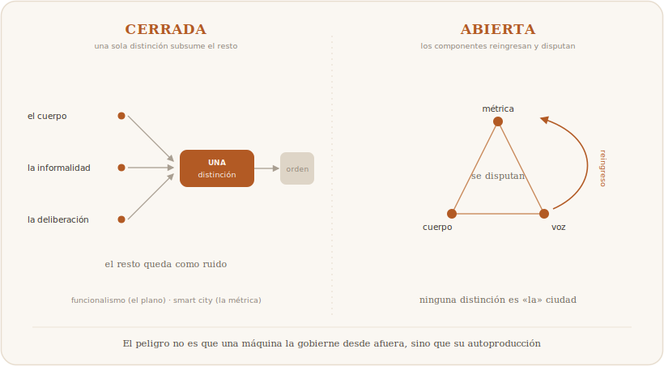

Un ejemplo la fija. Un tablero de control urbano puede mostrar, en tiempo real, que cierto corredor del centro está «congestionado» y recomendar redistribuir el flujo peatonal; el dato es exacto y la recomendación, ejecutable. Pero ese mismo corredor es, para quien lo camina cada día, un tejido de encuentros, miedos, economías informales y memoria: nada de eso aparece en el tablero, no porque falten sensores, sino porque no es del tipo de cosa que un sensor registra. La pregunta de este ensayo vive en esa brecha: no en si el tablero se equivoca —suele acertar en lo suyo— sino en qué queda afuera cuando la ciudad se vuelve legible sólo como lo que el tablero mide, y en quién decide dónde poner el sensor.

El ensayo despliega tres ejes. El **ontológico** contrapone el modo de ser de la ciudad —auto-organizada y encarnada— al de la máquina, que calcula sin mundo. El de la **técnica** pregunta qué permite la escala si no transforma la naturaleza de la operación, y muestra, con un experimento propio, que escalar mejora la imitación sin cruzar umbral categorial alguno. El del **poder** sostiene que toda computación urbana presupone una decisión previa —qué se mide, con qué métrica, al servicio de qué ciudad— y que esa decisión es política antes que técnica.

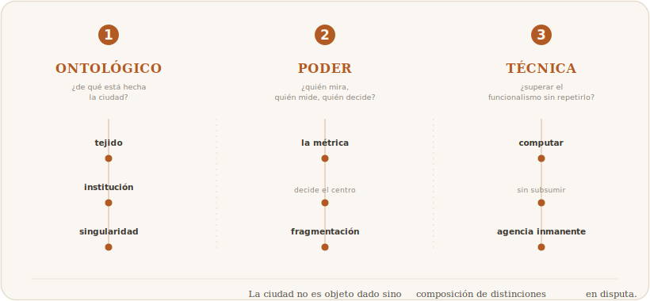

La contribución propia es doble y empírica. Primero, un **experimento T1–T6** que contrasta el cómputo determinístico con la IA estadística sin herramientas externas, para exhibir qué operación realiza la máquina cuando debe producir por sí misma el resultado. Segundo, el **Banco Epistémico Urbano**: un banco de pruebas reproducible que —construido, con ironía, orquestando IA bajo supervisión humana— fragmenta en lugar de escalar y devuelve al humano la decisión sobre qué es relevante. A ello se suman trece demostraciones computacionales de emergencia, auto-organización y robustez, siete de ellas sobre la red real de Medellín.

El análisis que sigue no funde autopoiesis y cómputo, sino que los mantiene en tensión productiva. Si la eficiencia funcional de un corredor urbano no garantiza por sí misma su habitabilidad, entonces el análisis computacional de la ciudad es necesario pero radicalmente incompleto. Procesar no es producir. El desafío es un conocimiento urbano que reconozca esa diferencia sin renunciar ni a la potencia de la máquina ni a la riqueza irreducible del habitar.

---

## 1. Eje ontológico — el modo de ser de la ciudad y el de la máquina

La pregunta que organiza este eje es doble: ¿de qué manera *es* la ciudad?, ¿de qué manera *es* la máquina que pretende conocerla? La tesis rectora —la IA procesa pero no produce conocimiento— se vuelve inteligible cuando se muestra que ambos modos de ser son registros irreductibles.

### 1.1. La ciudad emergente y encarnada

La ciudad tiene dos caras que ninguna reducción concilia: es a la vez un **orden mensurable** —trazados, flujos, densidades— y un **mundo vivido**, horizonte de significatividad en el que los cuerpos se orientan, padecen y deciden. La categoría para pensar la primera cara es la *auto-organización*. Maturana y Varela (1980) definieron la **autopoiesis** para los sistemas vivos —clausura operacional y autoproducción de los propios componentes—; Johnson (2001) formula la **emergencia** —propiedades globales que surgen de interacciones locales sin que ningún nivel superior las decrete—; Aguilar (2014) subraya que el nivel macro emergente es irreductible al micro. Conviene no confundirlos: la emergencia describe patrones globales no diseñados; la autopoiesis exige, además, clausura y autoproducción. Por eso este ensayo es cauto: **no afirma que la ciudad sea literalmente un sistema autopoiético en sentido estricto**, sino que la evidencia disponible hace *plausible y productiva* una lectura autopoiética. Para el registro social, Luhmann (1998) extiende la autopoiesis a los sistemas sociales —que se reproducen mediante comunicaciones—, y es esa versión, más que la biológica, la que resuena con la ciudad; pero incluso ahí la tesis fuerte queda como interpretación, no como teorema.

Esa cara mensurable es demostrable. El exponente Zipf **q = 1.006** sobre **33.933 ciudades reales** del mundo (GeoNames, R² = 0.984; estimación por máxima verosimilitud α = 2.05), con **q = 1.063** para Colombia (319 ciudades, R² = 0.997), documenta una jerarquía de tamaños que ninguna autoridad fijó (D1).

$$\text{rango} \times \text{tamaño}^{q} \approx \text{cte},\ q\approx 1$$

La ley de escala de Bettencourt–West, ajustada sobre **datos reales** —población frente al número de amenities mapeados en OpenStreetMap, en ciudades europeas de mapeo homogéneo— arroja un exponente **β = 0.90** (IC 95 % 0.70–1.10, R² = 0.76, n = 26): un power-law **medido, no inyectado** —a diferencia de un indicador calibrado de antemano—, con una pendiente ≈1 (el intervalo de confianza incluye la linealidad).

$$Y \propto N^{\beta},\ \beta \approx 0{,}90$$

*Cautela declarada:* con n=26 y un radio de conteo fijo (2,5 km) que trunca a las ciudades mayores, este exponente no acredita sub- ni superlinealidad ni transfiere a Medellín; vale como demostración **de método** (se estima del dato, no se fabrica), no como evidencia de tesis. Lo decisivo no es el valor exacto del exponente sino que exista una **regularidad de escala real y medida** —no fabricada— que enlaza tamaño y dotación urbana sin planificador central (D2). Y la dimensión fractal **D = 1.910** (R² = 0.9996), medida por box-counting sobre una huella sintética de 8192×8192, exhibe una forma con borde auto-similar sin escala característica —el rasgo que Batty y Longley (1994) y Batty (2013) sitúan en el centro de una ciencia de las ciudades— (D3; *nota honesta:* el umbral se fija en la mediana, de modo que el cúmulo es denso y **no** «crítico», y las ciudades reales miden D ≈ 1.7: la demostración vale como ilustración cualitativa, no como verificación de universalidad de percolación). Conviene marcar un matiz de nivel que a menudo se elude: **Zipf (D1) y la escala (D2) son regularidades del *sistema* de ciudades** —el ensemble inter-urbano—, no la prueba de que *una* ciudad singular se autoproduzca; sólo la forma (D3) y, más abajo, la segregación (D4), la red (D5) y la aglomeración del comercio informal (D11) operan en el nivel intra-urbano. Sobre esa misma red real, un juego de localización de Hotelling muestra que el comercio informal **se auto-organiza**: los venteros se aglomeran ~2,6× más que un óptimo de cobertura (D11) —el foco comercial es equilibrio emergente desde decisiones locales, no desorden a corregir; con honestidad, la mejor-respuesta cicla (no hay Nash puro) y la demanda es proxy—. Ninguno de estos resultados prueba autopoiesis; todos evidencian **emergencia, auto-organización e invariancia de escala**: la cara empírica consistente con una lectura autopoiética, no su demostración.

**Figura 1 (D1) — Ley de Zipf, sistema urbano mundial.** q = 1.006 (R² = 0.984; MLE α = 2.05) sobre 33.933 ciudades reales; Colombia q = 1.063 (R² = 0.997).
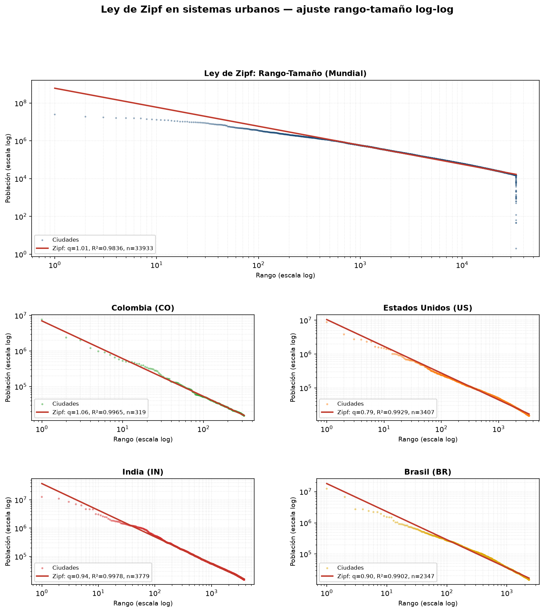

**Figura 2 (D2) — Ley de escala de Bettencourt–West sobre datos reales.** β = 0.90 (IC 0.70–1.10, R² = 0.76) sobre 26 ciudades europeas (población GeoNames vs. amenities OSM).
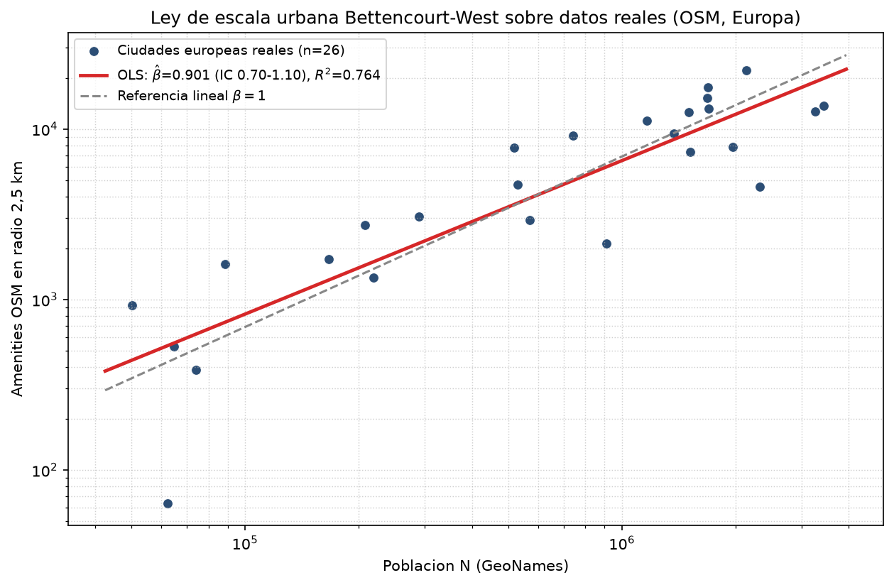

**Figura 3 (D3) — Dimensión fractal de una huella sintética.** D = 1.910 (R² = 0.9996), box-counting sobre 8192² (campo gaussiano correlacionado umbralizado en la mediana; cf. Makse et al., 1995). Ilustración cualitativa de forma sin escala característica; no es una ciudad real (D≈1.7) ni un cúmulo crítico.
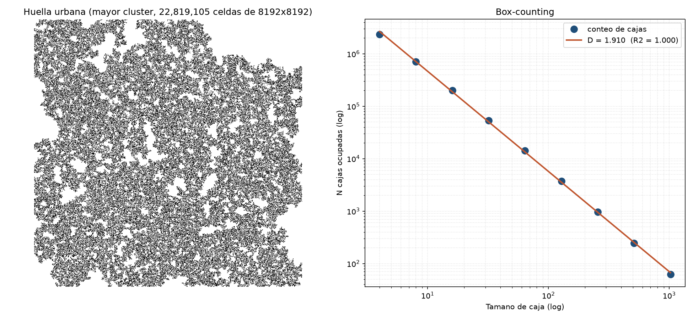

**Figura 4 (D11) — Juego de localización de Hotelling: el comercio informal se aglomera.** N vendedores informales eligen nodo sobre la red real (**7.598 nodos**), con demanda proporcional a la densidad local. Resultado: **se aglomeran** —índice de aglomeración **2,3×** vs el azar y **2,6×** vs el óptimo social (**40 vendedores**)—, patrón robusto en todo el barrido (aglomeración **2,1×–3,9×** vs óptimo). Honestidad: la mejor-respuesta cicla (no hay Nash puro: se fotografía una oscilación estable), demanda proxy, sin precios ni arriendo. Autopoiético: el foco comercial es un orden que **se auto-organiza** desde decisiones locales, no un desorden que corregir (código `ciencia/mega/D11_hotelling.py`).
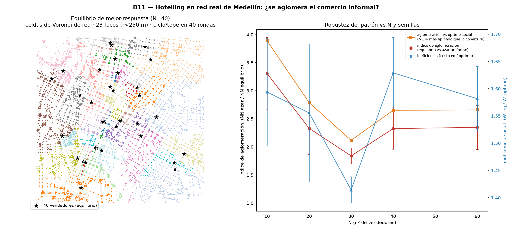

Ahora bien, la auto-organización describe el *orden* de la ciudad, no su *experiencia*. Aquí la fenomenología aporta lo que el dato no captura, y conviene no fundir a sus autores en un continuo sin costuras. Husserl (1936/1991) advierte contra la abstracción galileana que olvida el *Lebenswelt*, el mundo de la vida donde las cosas comparecen antes de ser medidas, y acuña la distinción entre el cuerpo físico (*Körper*) y el cuerpo vivido (*Leib*), «punto cero» de toda orientación (Husserl, *Ideas II*). Merleau-Ponty (1945/1993) radicaliza ese cuerpo propio como sujeto de una intencionalidad motriz: el transeúnte no ocupa la ciudad como un objeto entre objetos, la habita y la padece en la fatiga y el ruido. Esa fatiga deja huella medible: sobre la red real, la pendiente encoge el alcance caminable de 15 minutos un 16 % en el centro plano frente a un 24 % en la ladera (D12) —el terreno reescribe el radio del cuerpo que la métrica plana daba por neutral, aunque, con honestidad, el footfall mismo salga difuso y no en focos—. Heidegger, por su parte, aporta algo distinto y que no debe confundirse con lo anterior: no una teoría del cuerpo —de la que célebremente prescinde— sino la del **mundo como horizonte de significatividad** desde el cual algo puede importar. El ser-en-el-mundo del Dasein no es «vivencia» (*Erlebnis*, término que Heidegger problematiza) sino apertura previa a todo cálculo. Tenemos, pues, dos caras irreductibles: la *ciudad-computada* y la *ciudad-vivida*.

**Figura 5 (D6) — La «métrica del cuerpo»: la pendiente desplaza el centro.** Misma red real + elevación real (SRTM 30 m; desnivel 306 m). Ponderando cada arista por el esfuerzo de caminar en pendiente (función de Tobler, $v(s)=6\,e^{-3{,}5\left|s+0{,}05\right|}$), el «centro del cuerpo» se aparta ~229 m del «centro del flujo» y el 5 % más central sólo coincide en 53 % (Jaccard 0,53): la fatiga fenomenológica reescribe la centralidad — y explica el Metrocable (demostración D6; código en `ciencia/mega/D6_pendiente.py`).
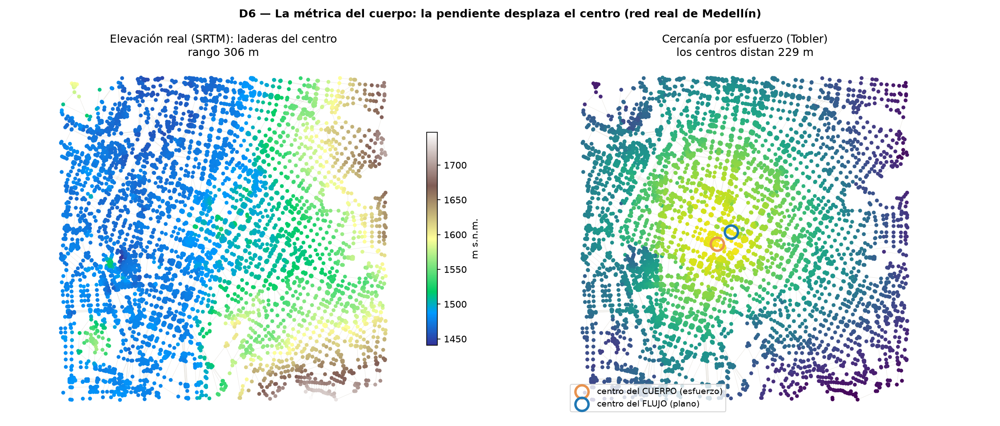

**Figura 6 (D12) — Difusión y esparcimiento sobre el grafo real.** Footfall (caminata de Tobler estacionaria) e isócronas de **15 min** sobre la red real (**22.863 nodos**) + elevación SRTM. El footfall sale **difuso**, no en hotspots (el top **1 %** de nodos concentra sólo **2,4 %** de la masa). La pendiente sí encoge el alcance: la isócrona de 15 min mengua **16 %** en el centro plano y **24 %** en la ladera. Honestidad: el footfall salió difuso (no dramático) y se reporta tal cual; el filo está en la asimetría del alcance por pendiente. Autopoiético: la circulación es un campo relacional cerrado sobre la propia red —clausura operacional— que el terreno reescribe (código `ciencia/mega/D12_difusion.py`).
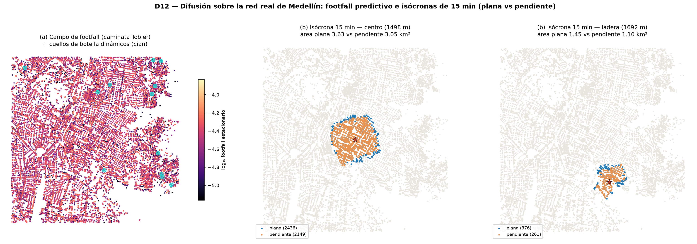

### 1.2. El modo de ser de la máquina

La tradición filosófica de la técnica caracteriza el modo de ser de la máquina con cuatro rasgos que convergen en una constatación: la recursividad técnica no equivale a autonomía teleológica, y la potencia de cómputo no constituye mundo.

Primero, la *exteriorización sin comprensión*. Para Bergson (1907), el *homo faber* deposita operaciones en herramientas que las conservan sin entenderlas: el ábaco suma sin saber que suma. Esa distancia se vuelve opaca cuando el soporte produce lenguaje articulado, pero no se anula. Segundo, la *recursividad sin fijación de fines*. Wiener (1948) introduce la retroalimentación, pero la autorregulación no produce autodeterminación de fines; Simondon (1958) lo precisa con la *concretización*: el objeto técnico gana coherencia interna sin generar finalidad propia —el motor no decide para qué sirve; lo decide el medio asociado—. Del mismo modo, el modelo de lenguaje no decide qué cuenta como respuesta correcta ni para qué se computa la ciudad. Tercero, la *clausura en el juicio determinante*. Hui (2019) recupera la distinción kantiana entre juicio determinante —subsumir un caso bajo una regla dada— y reflexionante —hallar la regla desde el caso—: la IA opera en el primer registro, porque hallar la regla supone decidir qué cuenta como relevante, y esa decisión no está en los datos. Cuarto, la *ausencia de mundo*. Heidegger distingue entes de mundo como horizonte de sentido; Dreyfus (1972) traduce esto en objeción a la IA: la relevancia de un hecho no está dada como un dato adicional, so pena de regreso al infinito. La máquina opera sobre huellas estadísticas de un mundo sin habitarlo.

### 1.3. Procesar no es comprender

Lo que los cuatro rasgos muestran no es que la máquina procese *mal*, sino que procesar y comprender son actos de distinta naturaleza. La tesis no es incontrovertida: un **realismo computacional** sostendría que comprender *es* procesar de forma suficientemente sofisticada, y que la diferencia es de grado. Contra esa objeción no basta reafirmar la tesis; hay que dar un argumento independiente, y la fenomenología lo ofrece. El argumento de Dreyfus no es empírico sino **de principio**: si la relevancia de un hecho tuviera que darse como un dato más, haría falta otro dato que fijara la relevancia de ese dato, y así al infinito; luego la relevancia no es una función que ninguna acumulación de subsunciones determinantes pueda alcanzar. Merleau-Ponty muestra que percibir no es recibir datos y procesarlos, sino estar ya volcado hacia un mundo significativo antes de toda tematización; Heidegger, que el mundo no es contenedor de entes sino aquello desde lo cual algo puede importar. Lo que la máquina no tiene —y ningún incremento de parámetros le da— es ese *estar-en-el-mundo* desde el cual la escena se ordena. Por eso, ante una misma escena, la máquina produce pertinencias plausibles pero no puede responder de cuál de ellas importa: es la *relevancia sin unicidad*. La diferencia es categorial, no gradual, y no se franquea acumulando más de lo mismo, porque lo que falta no es cantidad sino un para-qué situado.

### 1.4. Del límite ontológico a sus consecuencias

Lo anterior no niega utilidad a la máquina —el ensayo mismo se apoya en modelos computacionales—: afirma que su utilidad tiene un límite. Un modelo urbano es una representación deliberadamente empobrecida de la ciudad, y esa pobreza no es un defecto sino la contrapartida de su operatividad: el modelo sirve porque recorta, y ese recorte lo separa de la comprensión plena. Si el juicio de relevancia no se deja formalizar sin resto, entonces un cosmos computacional no agota el cosmos de la ciudad. La pregunta que este eje deja abierta —y que los dos siguientes retoman— no es si usar máquinas para pensar la ciudad, sino bajo qué condiciones su uso produce conocimiento y bajo cuáles lo simula. El desajuste no es de escala sino de registro ontológico: la máquina no tiene mundo; la ciudad *es* mundo. Lo que sigue es una cuestión técnica —qué puede y qué no puede delegarse al cómputo— y política —quién fija los fines para los cuales se computa la ciudad—.

---

## 2. Eje de la técnica — procesar no es producir

La ciudad se produce a sí misma; la técnica computacional la procesa. Yuk Hui localiza esa asimetría como desproporción: se moviliza un volumen incomparable de recursos materiales, energéticos y políticos para obtener, en el terreno del cálculo exacto, una garantía inferior a la del cómputo determinístico sobre el que se pretende construir inteligencia urbana. La pregunta que estructura este eje es clara: ¿qué permite la escala si no transforma la naturaleza de la operación? Conviene separar de entrada dos enunciados que el experimento propio ilumina, para no confundirlos: uno **empírico** —sin herramientas externas, la IA estadística no ejecuta algoritmos exactos con fiabilidad— y otro **ontológico** —procesar no es producir—. El primero se mide; el segundo se argumenta filosóficamente (eje anterior). Lo que sigue muestra el primero, y por qué no basta para fundar el segundo por sí solo.

El experimento contrasta cómputo determinístico e IA estadística sobre seis tareas (T1–T6). Las primeras cinco tienen verdad de referencia aritmética exacta; la sexta es no-computable. Los modelos operaron **sin herramientas externas** —privados de intérpretes— para exhibir qué operación realiza la máquina cuando debe producir por sí misma el resultado. Sobre las diez celdas evaluables (cinco tareas por dos intentos), el modelo menor (Claude Sonnet) acertó 9/10 (90 %) y el mayor (Claude Opus) 7/10 (70 %). Es tentador leer ahí que «el modelo mayor es menos fiable», pero honestamente **la diferencia no es significativa**: son dos celdas sobre diez (una prueba exacta de Fisher da p ≈ 0.58), y en un banco mayor de 39 preguntas el orden se **invierte** (Opus 92 % > Sonnet 90 %). Lo robusto, entonces, no es un ranking entre modelos, sino un **patrón de error**: los fallos aritméticos comparten los dígitos iniciales con el valor verdadero y divergen en los órdenes internos —la firma de un sistema que *estima* la magnitud en lugar de *acumularla* con fidelidad—. Esa es la observación que caracteriza todo el experimento.

La regularidad central aparece al desagregar el banco de 39 preguntas por tipo. Las 27 de **forma cerrada** —donde basta sustituir valores en una fórmula explícita— se resuelven casi perfectamente (Opus 100 %, Sonnet 93 %). Las 12 **emergentes** —que exigen ejecutar fielmente una iteración cuyo resultado sólo aparece tras desplegar el modelo— caen (Opus 75 %, Sonnet 83 %). El contraste ilumina el punto: donde hay un algoritmo explícito que *evaluar*, el modelo estima bien recombinando elementos plausibles; donde hay una dinámica que *ejecutar* sin desviación en cada paso, falla porque no ejecuta, estima. En cuanto a la escala, cuatro modelos locales (qwen2.5:3b, qwen3:14b, gpt-oss:20b, qwen3:32b) no mostraron una exactitud monótona en el número de parámetros; pero conviene ser prudente: son familias de entrenamiento distintas —de modo que «escala» no es la única variable— y algún resultado quedó afectado por límites de tiempo de cómputo. La lección segura no es que «más grande sea peor», sino que **la escala no compra fiabilidad aritmética de manera ordenada**: mejora la imitación, no la ejecución.

De aquí una consecuencia acotada, sin exagerar el blanco. Usar un LLM —sin herramientas— para resolver lo que un algoritmo exacto ejecuta en microsegundos, con garantía absoluta y energía despreciable, es un **mal uso de recursos**: en producción se le acopla un intérprete y entonces acierta siempre, de modo que la crítica no es «la IA falla la aritmética» —eso se resuelve con una calculadora— sino que **el relato de un salto epistémico por escala no se sostiene** donde el trabajo es formalizable. Hui localiza ahí el punto político: lo que hay no es un cambio de naturaleza, sino una mejora marginal de la verosimilitud vendida como tal.

La salida que el eje abre es la **fragmentación estratégica** del trabajo: reservar para el cómputo determinístico lo que ejecuta mejor —algoritmos exactos sobre modelos urbanos computables, de las jerarquías centrales de Christaller (1933) a la renta del suelo de Alonso (1964)— y para la IA estadística el dominio donde su capacidad es genuina, que no es garantizar verdades aritméticas sino **aventurar significado donde no lo hay formalizado**. La tarea T6 —una escena urbana sin estructura de datos ni función objetivo, donde hay que fijar qué es relevante antes de calcular— es precisamente no-computable, y los modelos produjeron respuestas plausibles y coherentes (dirigir la alerta al niño, al repartidor en moto, al acompañante, según jerarquías distintas de significatividad) no porque calcularan la respuesta correcta —que no existe como tal— sino porque operan en el registro del significado donde el cómputo puro no puede ni arrancar. Ésta es la *tecnodiversidad* de Hui: no escalar un modelo global único, sino acoplar máquinas distintas a registros distintos, trabajando *con* la ciudad —un sistema que se auto-organiza y que ningún cómputo gobierna desde afuera— en lugar de fantasear que el cómputo la produce.

Esta división del trabajo no es una concesión pragmática, sino una tesis sobre la forma correcta de conocer la ciudad. Un sistema de movilidad, por caso, debería resolver con cómputo determinístico lo que es exactamente calculable —rutas mínimas, capacidades, horarios— y reservar la IA estadística para lo que no tiene solución cerrada —anticipar cómo una comunidad se apropiará de una plaza, qué significará un cambio de recorrido para quienes lo usan—, sabiendo que ahí la máquina no *acierta* sino que *sugiere*, y que la última palabra es de quien habita. Confundir los dos registros —pedirle certeza a la sugerencia o creatividad al algoritmo exacto— es la raíz del sobredimensionamiento: se paga el costo energético y político de un modelo gigante para obtener lo que un cálculo barato ya garantiza, o se le exige a un cálculo que decida lo que sólo un juicio situado puede decidir.

El autómata de Schelling (D4) ofrece una imagen precisa de esta frontera. En una malla de **8000×8000 = 64 millones de celdas (58,9 millones de agentes)**, resuelta en 465 s aprovechando los 32 núcleos, partiendo de una mezcla aleatoria (índice 0.50) una preferencia local leve produce segregación global creciente —**0.87 con tolerancia 0.5**, hasta 0.92—, con un fenómeno real de no-monotonía: bajo intolerancia extrema (0.8) el sistema no logra asentarse y la segregación desciende a 0.55. Nadie diseñó la segregación: emerge de reglas locales. Y sin embargo, el cómputo **simula** la emergencia sin **vivirla**: los agentes no sienten la incomodidad de la convivencia ni negocian afectos. Conviene una precisión honesta que el propio modelo impone: cada agente opera con una **función objetivo local** (una fracción mínima de vecinos iguales), de modo que el modelo no descubre la segregación en la ciudad sino que la produce a partir de la regla que el modelador ya fijó. El patrón es reproducible; la vivencia es incógnita; y la regla es una imposición previa, no un hallazgo. Procesar la segregación en código no es producirla en espacios reales. Un segundo experimento sobre la red vial real lo confirma desde el otro lado: el ruteo egoísta de miles de viajeros produce un flujo agregado que nadie eligió —precio de la anarquía 1,03— y **cerrar una calle puede mejorarlo**, pues una arista-Braess robusta rebaja el tiempo total agregado un 1,37 % (D10, con demanda O-D sintética sobre la red real). El todo es **autónomo de sus partes**: la ciudad computada devuelve resultados que su computador no controla, y el funcionalismo fracasa cuando cierra la ciudad sobre la distinción del plano —cuando trata como *instrucción* lo que sólo puede ser *perturbación*—, en lugar de dejar su autoproducción abierta. Heidegger cierra el eje: «en todas partes estamos encadenados a la técnica». La cadena no está en la máquina, sino en creer que la máquina produce lo que en verdad sólo procesa. Usar la técnica sin esa ilusión es la puerta de entrada a la pregunta que el siguiente eje despliega: **quién fija los fines para los cuales se computa la ciudad**.

*(Los datos crudos del experimento —respuestas por celda y script de calificación— se incluyen junto al código para que la reproducibilidad sea efectiva y no declarativa.)*

**Figura 7 (D4) — Autómata de segregación de Schelling.** 64 M de celdas (58,9 M agentes): de 0.50 (aleatorio) a 0.87 (tolerancia 0.5), hasta 0.92, con no-monotonía a 0.55 (tolerancia 0.8).

**Figura 8 (D10) — Juego de congestión (Wardrop/Braess) sobre la red vial real de Medellín.** Equilibrio de usuario vs óptimo social (Frank–Wolfe, coste BPR estándar, $t_a(x)=t_a^{0}\!\left(1+0{,}15\left(\tfrac{x}{c_a}\right)^{4}\right)$) sobre la red de radio 4 km (**22.863 nodos, 33.988 aristas**), con demanda O-D **sintética** uniforme entre **300 zonas**. El **precio de la anarquía es 1,03** ($\mathrm{PoA}=\mathrm{TSTT}_{\text{UE}}/\mathrm{TSTT}_{\text{SO}}\approx 1{,}03$): el equilibrio egoísta casi iguala al óptimo social. Escaneando las calles más cargadas aparece **una arista-Braess robusta** —cerrarla mejora el tiempo total agregado **+1,37 %**—; las demás quedan en el piso de ruido del solver. Honestidad: demanda sintética y red peatonal usada como topología vial; lo robusto es el hallazgo cualitativo (existe efecto Braess). Autopoiético: el óptimo del todo no es la suma de óptimos egoístas —autonomía del todo sobre las partes— (código `ciencia/mega/D10_congestion.py`).
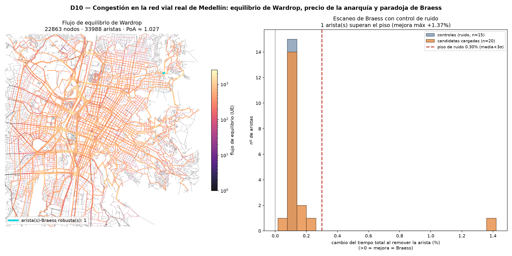

**Figura 9 (D7) — Cuánta institución cuesta romper el sorting.** Schelling (tol 0,5) con dos palancas de política. La *vivienda indiferente* (agentes que satisfacen a cualquiera) **no** rompe la segregación (0,87→0,95): diluir densidad no basta. La *vivienda anclada/integrada* (residentes fijos) **sí** la rompe, pero recién a partir de **~55 %** de vivienda intervenida (baja monótona 0,87→0,60, cruce del umbral 0,65 en p≈0,55). Sostiene «cultivar lo emergente»: la segregación es terca; no cualquier intervención sirve y romperla exige compromiso estructural fuerte — refuta el laissez-faire hayekiano sin caer en voluntarismo (código `ciencia/mega/D7_intervencion.py`).
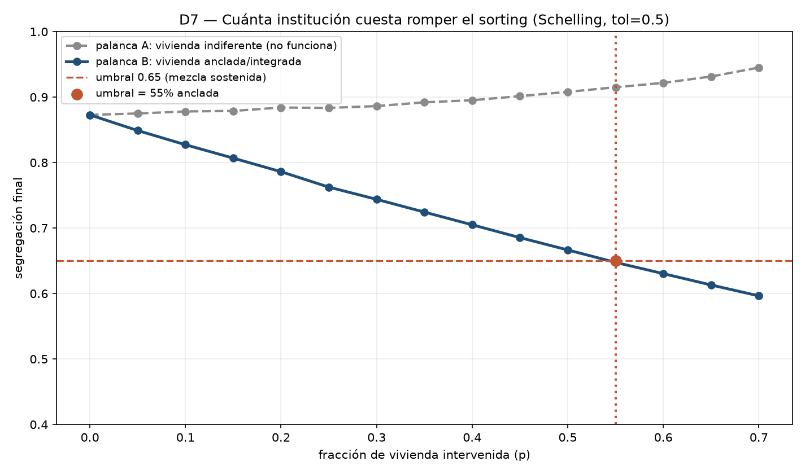

---

## 3. Eje del poder — quién computa la ciudad y con qué efectos

El poder urbano no es un añadido externo a la ciudad, sino una de las formas en que la ciudad se organiza, se percibe y se reproduce. Si la fenomenología exige «volver a las cosas mismas», ese retorno no puede dirigirse sólo a la calle como forma física o al flujo como variable, sino a la ciudad vivida en su espesor político. Desde Foucault (1975/2002), la ciudad moderna se lee como espacio de vigilancia, clasificación y normalización: el panóptico no es sólo una arquitectura carcelaria sino una racionalidad espacial que distribuye cuerpos y produce saberes administrables; en la biopolítica, la población se vuelve objeto de cálculo. Deleuze (1990) radicaliza el diagnóstico al mostrar el paso de las sociedades disciplinarias a las **sociedades de control**: «los controles constituyen una modulación… como un molde autodeformante que cambia constantemente». La *smart city* es, en ese sentido, un dispositivo deleuziano: no encierra necesariamente, pero **modula**; no prohíbe siempre, pero orienta; no reprime de modo visible, pero distribuye accesos, riesgos, tiempos de espera y trayectorias posibles. Leída con la autopoiesis, la *smart city* es la forma **cerrada** del sistema urbano: reproduce siempre sus mismas distinciones —su métrica, su retícula de sensores— y subsume el resto como ruido; la dominación no viene aquí de un soberano externo sino de esa clausura sobre una sola de las distinciones de la ciudad.

El problema político central no está en que la ciudad sea computada, sino en que **toda computación urbana presupone una decisión previa sobre qué cuenta como relevante**. La función objetivo no es una herramienta neutral: es un acto político formalizado. Optimizar velocidad, seguridad, rentabilidad, permanencia o habitabilidad implica jerarquizar valores urbanos. La condición de computabilidad no es una propiedad que el análisis descubra en la ciudad: presupone que alguien ya decidió qué es un nodo, qué una arista, qué lectura vale y qué métrica cuenta como distancia. La formalización no revela esa estructura; la **impone**. Kitchin (2014) lo muestra: la ciudad de datos en tiempo real promete objetividad técnica pero oculta las decisiones que hacen posible el dato —sensores instalados aquí y no allá, variables medibles y variables ignoradas, poblaciones visibles y poblaciones opacas—. Y Haraway (1991/1995) da la clave epistémica: todo conocimiento es **situado**, y su parcialidad no es un defecto que ocultar sino la condición ética de su responsabilidad; frente a ello, la pretensión de una visión total —propia del solucionismo de datos— reproduce una ilusión de omnisciencia.

Esta decisión previa tiene una forma reconocible: la de una **gubernamentalidad**. Cuando la administración urbana fija una función objetivo —minimizar tiempos de viaje, maximizar flujo comercial, «pacificar» un sector—, no describe la ciudad: la gobierna, en el sentido foucaultiano de conducir conductas a distancia. La biopolítica clásica calculaba tasas de natalidad, morbilidad y circulación; la ciudad computada añade una capa, porque cada optimización codifica qué poblaciones y qué usos del espacio cuentan como el óptimo y cuáles aparecen sólo como *fricción a minimizar*. El vendedor informal que «satura» una acera, el habitante de calle que «ensucia» un corredor en renovación, la protesta que interrumpe el flujo: todos entran en el modelo como ruido a suprimir, no como ciudad a atender. La neutralidad aparente del algoritmo es aquí su mayor eficacia política, porque naturaliza como técnica una decisión que es de gobierno. Por eso la crítica no puede quedarse en «los datos están sesgados»: el sesgo no es un error corregible con más datos, sino la huella de una jerarquía de valores inscrita en la elección misma de qué optimizar.

Esa imposición se puede **demostrar** con datos reales, no sólo enunciar. Se descargó la red peatonal **real** del centro de Medellín (La Candelaria) de OpenStreetMap: **7.598 nodos y 11.856 aristas** (D5). Sobre ella se calcularon tres medidas de centralidad **exactas**: intermediación (*betweenness*), cercanía (*closeness*) y de vector propio (*eigenvector*). Dos hallazgos. Primero, la centralidad **se concentra**: el 5 % superior de nodos por betweenness tiene **6,1 veces** la betweenness media —una prominencia estructural emergente de la topología, no decretada—. Segundo, y decisivo para el argumento político: **la elección de la métrica decide quién es "central"**. Los conjuntos del 5 % más central son **casi disjuntos** entre métricas (el solapamiento de Jaccard entre betweenness y closeness es 0,10; entre closeness y eigenvector, 0,00), y el **nodo más central es uno distinto bajo cada métrica** —tres lugares diferentes del centro—. No es, pues, una conjetura que «la centralidad podría desplazarse»: se desplaza, medido sobre la misma red real. Computar la centralidad la **revela**, pero quién elige la métrica decide qué aparece como central; y esa decisión —medir intermediación y no miedo, flujo y no cuidado, eficiencia y no arraigo— no está en el grafo. Allí se juega el poder: no en el número aislado, sino en las ausencias que el número estabiliza. Y la decisión no admite un óptimo neutral que la zanje: cuatro medidas de centralidad exactas rankean prioridades **casi disjuntas** (Jaccard medio 0,03; $J(A,B)=\dfrac{|A\cap B|}{|A\cup B|}$) y ningún criterio formal de robustez —el minimax-regret— selecciona una sin recaer en una patología, de modo que no hay portafolio de métricas que sea «el» correcto (D13). Ese resto no optimizable es el **margen inmanente** donde la ciudad decide sobre sí misma: el juicio de relevancia no se computa después, se ejerce desde dentro por quienes la habitan.

**Figura 10 (D5) — Red vial real de Medellín bajo tres métricas.** 7.598 nodos, 11.856 aristas; el 5 % superior por betweenness concentra 6,1× la media, y betweenness/closeness/eigenvector señalan centros casi disjuntos (Jaccard 0,10 / 0,04 / 0,00; eigenvector topológica, corregida el 7-jul: ponderarla por longitud invertía la semántica).

**Robustez (D9) — ¿estructura real o artefacto?** La red D5 se comparó contra 60 grafos nulos con la misma secuencia de grados (double-edge-swap, que destruye la geometría de calle), recalculando las métricas **sin ponderar** para una comparación limpia —de ahí que la prominencia (9,76) y el Jaccard (0,226) difieran de los valores ponderados de D5 (6,1× y 0,10): son la misma medida sobre otra base. La prominencia del corredor es estructura **real, no artefacto**: real **9,76** vs nulos 2,73 ± 0,04 (**z ≈ 188**, percentil 1,0). En cambio la divergencia entre métricas es una **propiedad general** de las redes (Jaccard real 0,226 vs nulos 0,192 ± 0,023, ~1,5 σ): coherente con citar D5 como verificación local de un resultado conocido (Crucitti et al., 2006), no como hallazgo idiosincrático (código `ciencia/mega/D9_robustez.py`).

**Figura 11 (D8) — Escala ciudad: la métrica y el cuerpo desplazan el centro en la Medellín real.** D5 y D6 repetidos sobre la red peatonal real de radio 4 km (**22.863 nodos**, centro + primer anillo hacia las laderas; closeness exacta con scipy.csgraph, betweenness muestreada k=1500). Con desnivel real de **962 m**: la prominencia del corredor sube a **7,6×**, la métrica sigue decidiendo el centro (Jaccard betweenness∩closeness **0,08**) y el «centro del cuerpo» dista **710 m** del «centro del flujo» (vs 229 m en el centro) — a más pendiente, más se aparta la centralidad encarnada. Fundamento cuantitativo del Metrocable a escala ciudad (código `ciencia/mega/D8_ciudad.py`).
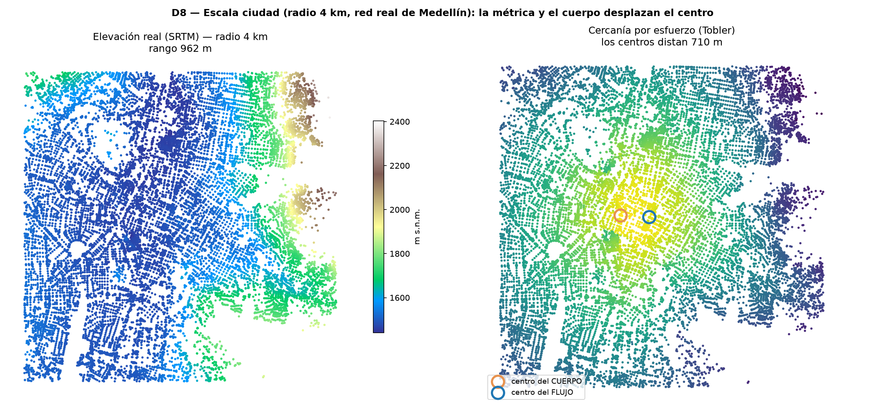

**Figura 12 (D13) — Teoría de la decisión (minimax-regret): el margen que ningún optimizador fija.** Sobre la misma red real (**22.863 nodos**), cuatro medidas de centralidad rankean nodos **casi disjuntos** (**Jaccard medio 0,03**). El minimax-regret formal ($\arg\min_{a}\max_{\theta}\big(R(a,\theta)\big)$) elige eigenvector, pero por una **patología** (métrica hiper-localizada); sin esa métrica degenerada, top_betweenness es la robusta y el portafolio mixto casi empata. Lectura: hay un **margen irreducible** —decidir qué métrica importa es exterior a la optimización—. Autopoiético: ese resto no optimizable es el **margen inmanente** donde la ciudad decide sobre sí misma (código `ciencia/mega/D13_decision.py`).
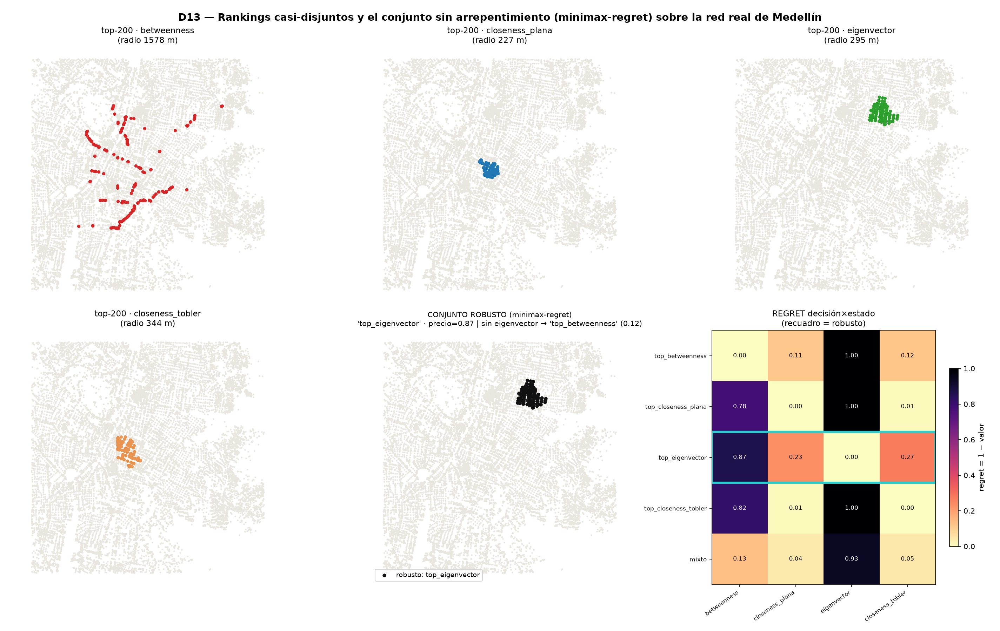

El corredor Junín–San Antonio encarna esa tensión. Es el eje peatonal que articula el centro histórico de Medellín —Parque Berrío, La Playa, Parque de San Antonio—: desde los datos de red es una vía de intermediación prominente, como cuantifica D5; desde la política urbana es un espacio de «renovación», inversión pública selectiva y regulación del comercio callejero; y desde la experiencia corporada de quienes lo recorren —sus ritmos de estrés, sus encuentros, su sentido de apropiación o desposesión— esos datos son ontológicamente mudos. La eficiencia funcional del corredor, computable y optimizable, no garantiza por sí misma su habitabilidad. Y aquí conviene poner a trabajar un autor, no desfilar varios: Lefebvre (1968/2017) distinguió el **espacio concebido** de la planificación —el de mapas, tableros y modelos— del **espacio vivido** de la práctica social, y mostró que una ciudad puede estar perfectamente representada y aun así fracasar como obra común; el «derecho a la ciudad» es justamente la exigencia de que el espacio vivido no quede subordinado al concebido. La métrica de centralidad pertenece al espacio concebido: hace legible una intermediación, pero no el arraigo que la métrica no mide. Harvey (2008) radicaliza esa exigencia como apropiación colectiva frente a la captura estatal y mercantil del espacio, y Sassen (2014) recuerda que la infraestructura de cómputo —nubes, GPU, plataformas y sensores propietarios— concentra funciones estratégicas y erosiona la autonomía técnica local: la **soberanía de cómputo** es, así, un problema urbano. Pero incluso reunidos, estos autores no reducen el poder a variable: el modelo sólo hace legibles ciertos efectos de dominación, y el resto —lo que el número estabiliza como ausencia— exige experiencia situada, conflicto e interpretación. Por eso la IA procesa información urbana pero no produce conocimiento de la ciudad en sentido pleno: el poder no es una variable que se compute después, es la relación que decide **antes** qué será computable, quién podrá medir, con qué infraestructura y al servicio de qué ciudad.

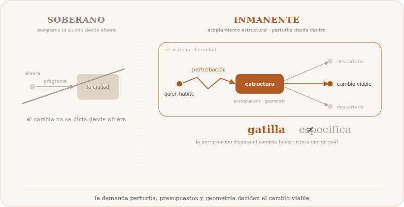

Y ese «con qué infraestructura» no es un detalle logístico. Computar la ciudad exige nubes, GPU, plataformas de datos y modelos entrenados que, en el Sur global, casi siempre son propiedad de corporaciones extranjeras: la ciudad se vuelve legible con herramientas cuyos fines, sesgos y precios se deciden en otra parte. Esto convierte el «derecho a la ciudad» de Lefebvre en un problema de infraestructura, y no sólo de espacio: de poco sirve habitar y apropiarse del espacio físico si la capacidad de *representarlo, medirlo y gobernarlo* se ha externalizado a una plataforma opaca. La soberanía de cómputo —conservar, a escala local, una pluralidad de criterios, datos y racionalidades para conocer la propia ciudad— es, leída con la tecnodiversidad de Hui, la condición material para que la decisión sobre qué importa no migre, junto con los servidores, fuera del alcance de quienes habitan. Fragmentar y localizar el cómputo no es entonces sólo una tesis epistemológica: es una tesis política sobre quién retiene el poder de nombrar el centro.

---

## 4. Síntesis — el Banco Epistémico Urbano

El recorrido por los tres ejes desemboca en una constatación que no es derrotista sino orientadora: la ciudad se resiste a ser agotada por el análisis computacional, no por insuficiencia de los algoritmos sino porque su modo de ser no es el de un conjunto de datos. La respuesta no es abandonar la computación sino **reubicarla**: construir un *Banco Epistémico Urbano*, una aplicación que la ciudad necesita precisamente porque renuncia a la ambición totalizadora de los grandes modelos predictivos. Frente a la pregunta que atraviesa estas páginas —¿produce conocimiento de la ciudad quien sólo procesa información sobre ella?—, el Banco no ofrece una respuesta teórica más, sino una *aplicada*: fragmenta en lugar de escalar, explora en lugar de optimizar, y devuelve al humano la decisión sobre qué es relevante.

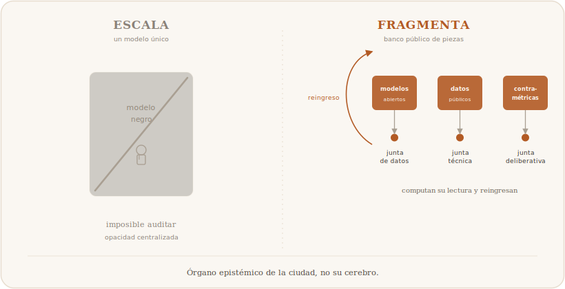

**Fragmentar antes que escalar (respuesta al eje ontológico).** Los resultados empíricos de este ensayo —Zipf casi perfecto (q = 1.006) sobre 33.933 ciudades reales, escala de Bettencourt–West sobre datos reales de OSM (β = 0.90) y dimensión fractal no-entera (D = 1.910)— son la cara empírica de una lectura autopoiética: indicios de que el sistema urbano se auto-organiza sin planificador central y de que la forma carece de escala característica. Si la ciudad se autoproduce, la pretensión de un modelo único que la capture por completo es una mala respuesta a una buena pregunta. El Banco propone, en cambio, fragmentar la información en módulos acotados que respeten la granularidad real de los fenómenos —uno para la jerarquía de tamaños, otro para la morfología, otro para la segregación—: cada fragmento respeta la escala de su fenómeno y ninguno subsume a los demás. Un modelo urbano es una representación deliberadamente empobrecida de la ciudad, y esa pobreza es la condición misma de su utilidad; fragmentar es aceptarla sin disfrazarla de completitud.

**Explorar antes que optimizar (respuesta al eje de la técnica).** El modelo de Schelling es revelador: la segregación pasa de 0.50 a 0.87 con tolerancia 0.5, y su estabilidad numérica no equivale a verdad empírica sobre la experiencia segregada de una ciudad real —una simulación puede ser estable porque el sistema está bien implementado, porque los supuestos reducen demasiado la diversidad o porque faltan perturbaciones reales—. El Banco es, por eso, un espacio de *exploración*, no de optimización: no promete predecir el próximo valor de un indicador ni hallar el parámetro óptimo; ofrece la posibilidad de *jugar* con los supuestos y observar que sus cambios no revelan una verdad oculta de la ciudad sino una verdad sobre el modelo. Se sitúa en el régimen de la **suficiencia**: suficiente para interrogar, insuficiente para clausurar. Disponemos de herramientas epistémicas sobredimensionadas respecto de su aplicación efectiva sobre la ciudad, y el Banco es una respuesta a esa desproporción: una herramienta cuyo costo crece en proporción al saber que produce, no muy por encima de él.

**Devolver la decisión al humano (respuesta al eje del poder).** El análisis de la red real de Medellín mostró que la métrica elegida decide qué se vuelve visible: betweenness, closeness y eigenvector señalan centros casi disjuntos. Computar la centralidad la revela pero no la produce, y quien elige la métrica decide qué importa. El Banco no oculta esa decisión bajo una capa de optimización automática: la **exhibe**. Presenta al usuario —planificador, investigador, ciudadano— un conjunto de fragmentos analíticos y le devuelve la responsabilidad de interpretarlos, con conciencia de sus propios presupuestos. Es, en el sentido husserliano, un intento de volver a las cosas mismas: no a la ciudad como constructo de datos, sino a la ciudad como experiencia vivida y atravesada por relaciones de poder.

**Ironía performativa.** Cerramos con una observación constitutiva del gesto de este ensayo. La tesis que aquí se defiende —que la IA procesa pero no produce conocimiento de la ciudad— fue construida *orquestando* IA bajo supervisión humana: los modelos computacionales cuyos resultados se presentan fueron ejecutados, iterados y refinados por delegación a sistemas de IA, bajo un régimen de co-producción asimétrica donde el autor conservó siempre la decisión última sobre qué preguntar, qué interpretar y qué concluir. Criticar los límites del análisis computacional usando ese mismo análisis no es una contradicción: es la **demostración performativa** del argumento. La máquina procesa, itera, simula y hasta sugiere; lo que no puede es *comprender* la ciudad, porque comprenderla exige habitarla, y habitar no es una operación computable.

**Aplicar antes que escalar. Fragmentar antes que optimizar.** No es un eslogan, sino el principio de una relación distinta entre ciudad, conocimiento y computación: la ciudad se autoproduce; el análisis computacional la interroga; la decisión sobre qué es relevante —y, por tanto, sobre qué ciudad se construye— sigue siendo, irreductiblemente, humana.

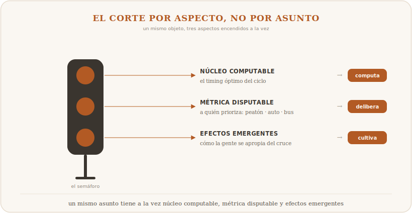

---

## 5. Conclusiones

Tres ejes, una distinción: **procesar no es producir**. En el eje *ontológico*, las demostraciones muestran que la ciudad se auto-organiza —Zipf casi perfecto, escala medida sobre datos reales, forma fractal—, pero esa emergencia mensurable es la cara empírica *consistente con* una comprensión autopoiética, no su prueba: la máquina describe la estructura sin habitar el mundo que la produce. En el eje de la *técnica*, el experimento propio muestra que, sin herramientas, la IA estadística estima la forma del resultado sin ejecutarlo, y que escalar mejora la imitación sin cruzar umbral categorial: el límite categorial hay que argumentarlo —vía relevancia y mundo—, no derivarlo de un test aritmético. En el eje del *poder*, la red real de Medellín demuestra que la métrica elegida decide qué cuenta como central: computar la ciudad no es un acto neutro, porque la función objetivo se fija *antes* del cálculo y quien la fija —y posee la infraestructura para computarla— decide qué ciudad importa.

La conclusión no es tecnófoba ni tecno-optimista. Estamos, como advierte Heidegger, encadenados a la técnica; la libertad frente a ella no empieza por afirmarla ni por negarla, sino por reconocer su límite. Lo que queda por hacer no es un modelo más potente, sino una herramienta más honesta: la que, en lugar de prometer conocer la ciudad mejor que sus habitantes, les devuelva —en fragmentos deliberadamente pobres pero epistémicamente suficientes— los materiales para que un conocimiento siempre situado, parcial y político pueda producirse. Ése es el sentido último de la consigna que se sigue de todo el recorrido: **aplicar antes que escalar, fragmentar antes que optimizar**. La ciudad autopoiética, encarnada y política excede a su análisis computacional; y esa distancia, lejos de ser un fracaso de la técnica, es el lugar donde la ciudad sigue siendo nuestra.

---

## Apéndice — Demostraciones computacionales

Las trece demostraciones (D1–D13) se intercalan —con su figura y su encuadre honesto— en los §1–§3 donde se argumentan. El código reproducible está en `ciencia/mega/` (`D1_mega.py`…`D13_mega.py`) y las cifras con su encuadre completo en [`ciencia/RESULTADOS.md`](../ciencia/RESULTADOS.md). Ejecución local (32 núcleos, 125 GB RAM), semilla fija (`42`).

---

## Bibliografía

**Autopoiesis, emergencia y ciencia de las ciudades**
- Aguilar, J. (2014). *Sistemas emergentes y control inteligente*. Universidad de Los Andes.
- Alonso, W. (1964). *Location and land use: Toward a general theory of land rent*. Harvard University Press.
- Batty, M. (2013). *The new science of cities*. MIT Press.
- Batty, M., & Longley, P. (1994). *Fractal cities: A geometry of form and function*. Academic Press.
- Bettencourt, L. M. A., Lobo, J., Helbing, D., Kühnert, C., & West, G. B. (2007). Growth, innovation, scaling, and the pace of life in cities. *Proceedings of the National Academy of Sciences, 104*(17), 7301–7306. https://doi.org/10.1073/pnas.0610172104
- Christaller, W. (1933). *Die zentralen Orte in Süddeutschland*. Gustav Fischer.
- Johnson, S. (2001). *Sistemas emergentes: qué tienen en común hormigas, neuronas, ciudades y software*. Fondo de Cultura Económica.
- Luhmann, N. (1998). *Sistemas sociales: lineamientos para una teoría general*. Anthropos. (Obra original publicada en 1984).
- Makse, H. A., Havlin, S., & Stanley, H. E. (1995). Modelling urban growth patterns. *Nature, 377*, 608–612. https://doi.org/10.1038/377608a0
- Maturana, H., & Varela, F. (1980). *Autopoiesis and cognition: The realization of the living*. D. Reidel.
- Schelling, T. C. (1971). Dynamic models of segregation. *Journal of Mathematical Sociology, 1*(2), 143–186.
- Zipf, G. K. (1949). *Human behavior and the principle of least effort*. Addison-Wesley.

**Fenomenología y ciudad**
- Dreyfus, H. L. (1972). *What computers can't do: A critique of artificial reason*. Harper & Row.
- Husserl, E. (1991). *La crisis de las ciencias europeas y la fenomenología trascendental* (J. Muñoz y S. Mas, Trads.). Crítica. (Obra original publicada en 1936).
- Merleau-Ponty, M. (1993). *Fenomenología de la percepción* (J. Cabanes, Trad.). Planeta-Agostini. (Obra original publicada en 1945).

**Técnica, cosmotécnica e individuación**
- Bergson, H. (1907). *L'évolution créatrice*. Félix Alcan.
- Heidegger, M. (1994). La pregunta por la técnica. En *Conferencias y artículos* (E. Barjau, Trad.). Ediciones del Serbal. (Obra original publicada en 1954).
- Hui, Y. (2016). *The question concerning technology in China: An essay in cosmotechnics*. Urbanomic.
- Hui, Y. (2019). *Recursivity and contingency*. Rowman & Littlefield.
- Simondon, G. (1958). *Du mode d'existence des objets techniques*. Aubier.
- Wiener, N. (1948). *Cybernetics: Or control and communication in the animal and the machine*. MIT Press.

**Poder, economía política y conocimiento situado**
- Deleuze, G. (1990). Post-scriptum sobre las sociedades de control. *L'Autre Journal, 1*.
- Foucault, M. (2002). *Vigilar y castigar: nacimiento de la prisión* (A. Garzón del Camino, Trad.). Siglo XXI. (Obra original publicada en 1975).
- Haraway, D. J. (1995). *Ciencia, cyborgs y mujeres: la reinvención de la naturaleza* (M. Talens, Trad.). Cátedra. (Obra original publicada en 1991).
- Harvey, D. (2008). The right to the city. *New Left Review, 53*, 23–40.
- Kitchin, R. (2014). *The data revolution: Big data, open data, data infrastructures and their consequences*. SAGE.
- Lefebvre, H. (2017). *El derecho a la ciudad* (I. Martínez, Trad.). Capitán Swing. (Obra original publicada en 1968).
- Sassen, S. (2014). *Expulsions: Brutality and complexity in the global economy*. Harvard University Press.
